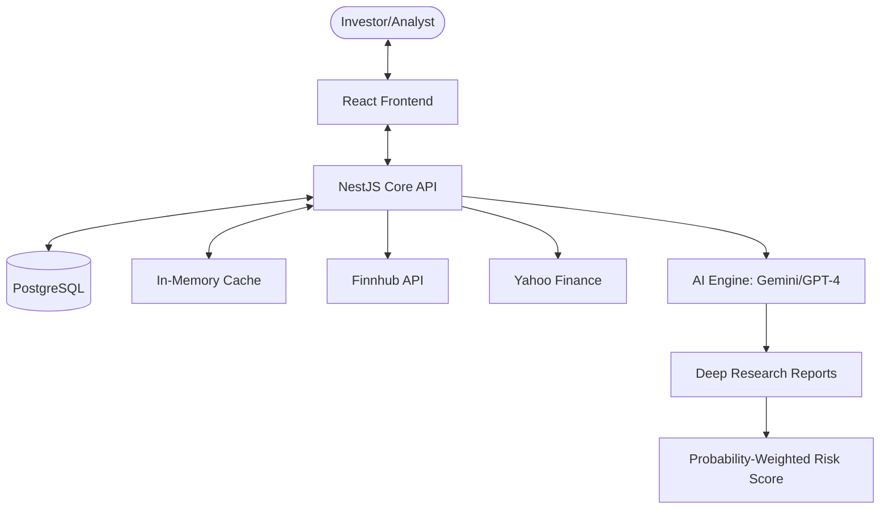

# 🧠 Neural-Ticker


> **Neural-Ticker** is a state-of-the-art, AI-driven equity research and risk-analysis platform. It bridges the gap between raw market data and actionable investment theses by leveraging Large Language Models (LLMs) to perform deep qualitative research and quantitative risk scoring.

---

## 🚀 Key Features

### 🏛️ Professional Research Pipeline
- **Smart News Briefing**: Native AI-curated daily digests of your top watchlists.
- **Deep Research Agent**: Autonomous multi-minute investigations using `gemini-3-pro-preview` to analyze 10-Ks, regulatory risks, and competitive landscapes.
- **Automated SWOT Analysis**: Qualitative factors (Strengths, Weaknesses, Opportunities, Threats) extracted directly from research nodes.

### ⚖️ Advanced Risk Scoring (Neural Rating)
- **Probability-Weighted Verdicts**: Advanced algorithm incorporating behavioral economics (Loss Aversion Factor 2.0x).
- **Skew Analysis**: Rewards favorable risk-reward asymmetry and penalizes catastrophic downside.
- **Multidimensional Risk**: Scores for Financial, Execution, Dilution, Competitive, and Regulatory risks.

### 📊 Real-Time Market Intelligence
- **Hybrid Data Sourcing**: High-performance ingestion from Finnhub and Yahoo Finance.
- **Market Snapshots**: Instant retrieval of price, fundamentals, and analyst ratings.
- **Candlestick Visualizations**: Integrated TradingView Lightweight Charts with custom design system tokens.

---

## 🏛️ Ecosystem Architecture



## 🛠️ Technology Stack

| Layer | Technology |
| :--- | :--- |
| **Backend** | [NestJS](https://nestjs.com/) (Modular Architecture) |
| **Frontend** | [React](https://react.dev/), [Vite](https://vitejs.dev/), [shadcn/ui](https://ui.shadcn.com/) |
| **Persistence** | [PostgreSQL](https://www.postgresql.org/) (Production), [TypeORM](https://typeorm.io/) |
| **AI / ML** | [Google Gemini](https://deepmind.google/technologies/gemini/), [OpenAI GPT-4/5](https://openai.com/) |
| **Styling** | [Tailwind CSS](https://tailwindcss.com/), [shadcn/ui](https://ui.shadcn.com/) |
| **Testing** | [Jest](https://jestjs.io/), [Vitest](https://vitest.dev/), [Cypress](https://www.cypress.io/) |

---

## 📂 Repository Structure

```
neural-ticker/
├── src/                # Backend (NestJS)
│   ├── modules/        # Core business logic (Auth, Market, Research, Risk)
│   ├── common/         # Middlewares, interceptors, guards
│   └── migrations/     # Database versioning
├── frontend/           # Frontend (React + Vite)
│   ├── src/
│   │   ├── components/ # Atomic UI & Business components
│   │   ├── services/  # API layer
│   │   └── lib/       # Shared utilities (Rating logic, API clients)
├── .github/            # CI/CD Workflows (deployment, crons)
└── docker-compose.yml  # Local infrastructure orchestration
```

---

## 🔬 Risk Analysis Extraction

The `RiskRewardService` utilizes a resilient two-phase pipeline to transform unstructured AI research into structured database entities:

1. **LLM Extraction**: Preferred output in **TOON** or JSON format.
2. **Regex Salvage**: A "last-resort" extraction engine that recovers data from malformed LLM responses using high-precision regex patterns.

This ensures that even if an AI model hallucinates formatting, the core numeric data (Prices, Scores, Probabilities) remains intact.

---

## 🔐 Security & Governance

- **Fine-Grained Access Control**: Multi-tier user system (Free, Pro, Whale, Admin).
- **Audit Logging**: Comprehensive auth logs and credit transaction history.
- **Admin Console**: Unified identity management and real-time "Shadow Banning" for tickers.
- **Global Validation**: Strict DTO enforcement via `class-validator` and TypeScript `strict: true`.

---

## 🏁 Getting Started

### Prerequisites
- Node.js v20+
- PostgreSQL (or use the provided Docker setup)
- Finnhub API Key

### Installation

1. **Clone & Install Dependencies**
   ```bash
   git clone https://github.com/404-Profit-Not-Found/neural-ticker-core.git
   cd neural-ticker-core
   npm install
   cd frontend && npm install
   ```

2. **Environment Configuration**
   Follow the `.env.example` in both root and `frontend` directories.

3. **Development Mode**
   ```bash
   # Start Backend (Port 3000)
   npm run start:dev

   # Start Frontend (Vite)
   cd frontend && npm run dev
   ```

---

## 📄 License
This project is licensed under the Apache 2.0 License - see the [LICENSE](LICENSE) file for details.

---
*Built for the next generation of quantitative and qualitative analysts.*
