# 🧠 Neural-Ticker


> **Neural-Ticker** is an AI-powered equity research and risk-analysis platform designed for retail and institutional investors. It bridges raw market data with actionable investment theses by leveraging Large Language Models (LLMs) to perform deep qualitative research and quantitative risk scoring.

---

## 🚀 Core Value Proposition

| Capability | Description |
|:---|:---|
| **Autonomous Research** | Multi-minute AI investigations using Gemini/GPT-5 to analyze 10-Ks, competitive landscapes, and regulatory risks |
| **Probability-Weighted Verdicts** | Advanced scoring incorporating behavioral economics (Loss Aversion Factor 2.0x) |
| **Real-Time Market Intelligence** | Hybrid data sourcing from Finnhub and Yahoo Finance with candlestick visualizations |

---

## 🏛️ System Architecture


---

## 🛠️ Technology Stack

| Layer | Technology | Purpose |
|:---|:---|:---|
| **Backend** | NestJS 11, TypeORM | Modular API architecture with DI |
| **Frontend** | React 19, Vite, Tailwind | Premium SPA with dark mode |
| **Database** | PostgreSQL | Relational data + JSONB for flexibility |
| **AI/ML** | Gemini 3, GPT-5.1 | Research generation, scoring, digests |
| **External APIs** | Finnhub, Yahoo Finance | Real-time prices, fundamentals, news |

---

## 📦 Feature Inventory

### 🧠 AI & Research

| Feature | Module | Description |
|:---|:---|:---|
| **Deep Research Agent** | `src/modules/research/research.service.ts` | Autonomous multi-minute investigations |
| **Smart News Briefing** | `src/modules/research/research.service.ts` | AI-curated daily digests |
| **Quality Scoring** | `src/modules/research/quality-scoring.service.ts` | Automated grading (1-10 scale) |
| **Ensemble Mode** | `src/modules/llm/llm.service.ts` | Run Gemini + OpenAI, combine outputs |
| **SWOT Extraction** | `src/modules/risk-reward/risk-reward.service.ts` | Structured SWOT analysis |

### ⚖️ Risk & Scoring

| Feature | Module | Description |
|:---|:---|:---|
| **Neural Rating Algorithm** | `frontend/src/lib/rating-utils.ts` | Composite score (0-100) with 6+ factors |
| **Probability-Weighted Returns** | `frontend/src/lib/rating-utils.ts` | Bull/Base/Bear with LAF 2.0x |
| **Multi-Dimensional Risk** | `src/modules/risk-reward/risk-reward.service.ts` | Financial, Execution, Dilution risks |

```mermaid
flowchart LR
    subgraph Inputs["Rating Inputs"]
        UP[Upside %]
        RISK[Financial Risk]
        SCORE[Neural Score]
        PE[P/E Ratio]
        NEWS[News Sentiment]
    end

    subgraph Outputs["Verdicts"]
        SB[Strong Buy ≥80]
        BUY[Buy ≥65]
        HOLD[Hold ≥45]
        SELL[Sell <45]
    end

    Inputs --> |Weighted Algorithm| Outputs
```



### 📊 Market Data

| Feature | Module | Description |
|:---|:---|:---|
| **Stock Analyzer** | `src/modules/market-data/market-data.service.ts` | Paginated, filtered screener |
| **Real-Time Snapshots** | `src/modules/market-data/market-data.service.ts` | Price, fundamentals, sparklines |
| **Company News** | `src/modules/market-data/market-data.service.ts` | Cached with Finnhub + Yahoo fallback |
| **Candlestick Charts** | `frontend/src/components/ticker/` | TradingView integration |

### 💼 Portfolio Management

| Feature | Module | Description |
|:---|:---|:---|
| **Position Tracking** | `src/modules/portfolio/portfolio.service.ts` | Holdings with cost basis |
| **Live Valuation** | `src/modules/portfolio/portfolio.service.ts` | Real-time P&L |
| **AI Portfolio Analysis** | `src/modules/portfolio/portfolio.service.ts` | LLM-powered analysis |

### 👤 User Management

| Feature | Module | Description |
|:---|:---|:---|
| **Multi-Tier System** | `src/modules/users/entities/user.entity.ts` | Free → Pro → Whale tiers |
| **Credit Economy** | `src/modules/users/credit.service.ts` | Earn via contributions, spend on research |
| **OAuth 2.0 Login** | `src/modules/auth/` | Google OAuth + Firebase Auth |

### 💬 Social & Community

| Feature | Module | Description |
|:---|:---|:---|
| **Ticker Discussion** | `src/modules/social/` | Comment threads per ticker |
| **Watchlists** | `src/modules/watchlist/watchlist.service.ts` | Create/manage multiple lists |
| **Notifications** | `src/modules/notifications/notifications.service.ts` | Real-time alerts via RxJS |

### 🛡️ Admin Console

| Feature | Module | Description |
|:---|:---|:---|
| **User Management** | `frontend/src/pages/AdminConsole.tsx` | Approve/reject users, change tiers |
| **Shadow Banning** | `src/modules/tickers/tickers.service.ts` | Hide tickers from global search |
| **System Stats** | `frontend/src/pages/AdminConsole.tsx` | Strong Buy/Sell counts |

---

## 📂 Repository Structure

```
neural-ticker/
├── src/                # Backend (NestJS)
│   ├── modules/        # Core business logic (19 modules)
│   ├── common/         # Middlewares, interceptors, guards
│   └── migrations/     # Database versioning
├── frontend/           # Frontend (React + Vite)
│   ├── src/
│   │   ├── components/ # Atomic UI & Business components
│   │   ├── pages/      # Route pages
│   │   └── lib/        # Shared utilities (Rating logic)
├── .github/            # CI/CD Workflows
└── docker-compose.yml  # Local infrastructure
```

---

## 🔬 Data Flow: Research Pipeline


---

## 🔐 Security & Governance

| Control | Implementation |
|:---|:---|
| **Authentication** | Firebase Auth + JWT (passport-jwt) |
| **Authorization** | Role-based guards (Admin, User) |
| **Rate Limiting** | @nestjs/throttler |
| **Input Validation** | class-validator + DTOs |
| **Audit Trail** | CreditTransaction logs, research history |

---

## 🏁 Getting Started

### Prerequisites
- Node.js v20+
- PostgreSQL (or use Docker)
- Finnhub API Key

### Installation

```bash
git clone https://github.com/404-Profit-Not-Found/neural-ticker-core.git
cd neural-ticker-core
npm install
cd frontend && npm install
```

### Development Mode

```bash
# Backend (Port 3000)
npm run start:dev

# Frontend (Vite)
cd frontend && npm run dev
```

---

## 📊 Module Inventory

| Module | Purpose |
|:---|:---|
| `auth` | Authentication, OAuth, JWT |
| `users` | User CRUD, credit management |
| `tickers` | Ticker registry, shadow banning |
| `market-data` | Prices, fundamentals, news, analyzer |
| `research` | AI research, digests, contributions |
| `risk-reward` | SWOT, scenarios, scoring |
| `llm` | Gemini/OpenAI providers |
| `portfolio` | Positions, AI analysis |
| `watchlist` | Lists, favourites |
| `notifications` | Real-time alerts |
| `social` | Comments, discussions |
| `jobs` | Cron jobs, scheduled tasks |

---

## 📄 License

This project is licensed under the Apache 2.0 License - see the [LICENSE](LICENSE) file for details.

---

*Built for the next generation of quantitative and qualitative analysts.*
