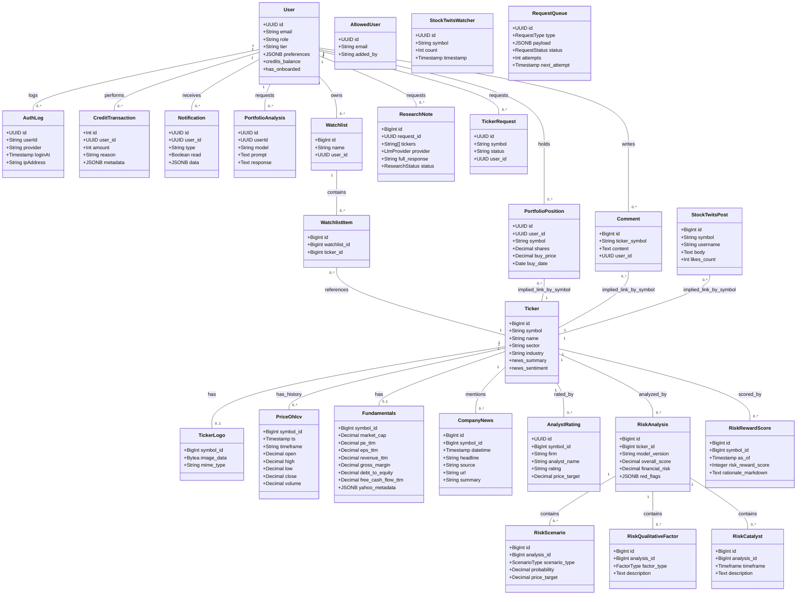

# Database Schema Analysis

This document outlines the complete database structure for the Neural-Ticker application, incorporating all 26 TypeORM entities found in the codebase.

## Overview

The database extends the core domains with detailed financial data, risk analysis components, and administrative tracking.

### Domains
1.  **Users & Auth**: Users, Auth Logs, Allowed Users, Credit Transactions, Notifications.
2.  **Market Data**: Tickers, Logos, Price History (OHLCV), Fundamentals, Company News, Analyst Ratings.
3.  **Portfolio**: Portfolio Positions, Portfolio Analysis.
4.  **Research & Risk**: Research Notes (LLM), Risk Analysis (Scenarios, Factors, Catalysts), Risk/Reward Scores.
5.  **Social**: Comments, StockTwits Posts, StockTwits Watchers (Trackers).
6.  **Admin/Jobs**: Ticker Requests, Request Queue.
7.  **Lists**: Watchlists, Watchlist Items.

## Mermaid Class Diagram

## Entity Details

### Market Data Deep Dive
-   **Fundamentals**: Stores key financial ratios and data points (`pe_ttm`, `market_cap`, `revenue_ttm`, etc.) separate from the main Ticker table to keep the Ticker table lightweight for listings.
-   **CompanyNews**: Stores news items linked to a ticker, sourced from external providers (e.g., Finnhub).
-   **AnalystRating**: Tracks historical buy/sell ratings and price targets from major firms.

### Risk Analysis Granularity
-   The Risk module is highly structured. [RiskAnalysis](file:///c:/Users/brani/Documents/GitHub/neural-ticker-core/src/modules/risk-reward/entities/risk-analysis.entity.ts#17-198) allows for versioned models.
-   It breaks down into sub-tables ([RiskScenario](file:///c:/Users/brani/Documents/GitHub/neural-ticker-core/src/modules/risk-reward/entities/risk-scenario.entity.ts#17-64), [RiskQualitativeFactor](file:///c:/Users/brani/Documents/GitHub/neural-ticker-core/src/modules/risk-reward/entities/risk-qualitative-factor.entity.ts#18-41), [RiskCatalyst](file:///c:/Users/brani/Documents/GitHub/neural-ticker-core/src/modules/risk-reward/entities/risk-catalyst.entity.ts#16-39)) to enable detailed frontend displays of "Bear/Bull Cases", "SWOT Analysis", and "Upcoming Catalysts".

### Social & Community
-   **Comment**: Internal user comments on tickers.
-   **StockTwitsPost** & **StockTwitsWatcher**: Mirrors external social sentiment data for analysis.

### Admin & Operations
-   **AllowedUser**: For controlling access (e.g., private beta/waitlist).
-   **RequestQueue**: A generic table for handling background jobs, primarily used for `ADD_TICKER` requests that require long-running data ingestion.
