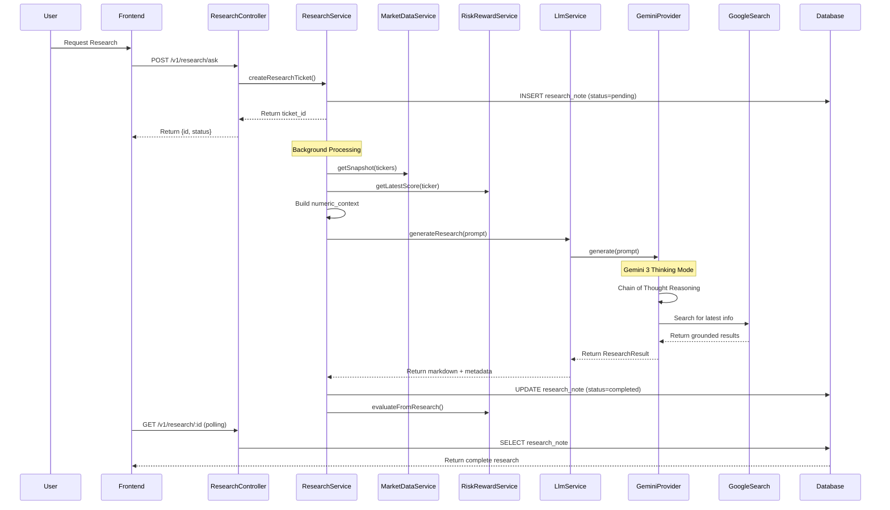

# Neural-Ticker AI Research Architecture - Comprehensive Analysis & Improvements

## Executive Summary

This document provides a comprehensive analysis of the AI Research backend architecture, identifies current limitations, and proposes improvements to enhance the system's capabilities, particularly focusing on:
1. **Gemini 3 as default model** with Google Search integration
2. **Full original response storage** for frontend consumption
3. **Dynamic title generation** based on research findings
4. **Enhanced database schema** for better data management

---

## 1. Current Architecture Overview

### 1.1 High-Level Flow



### 1.2 Core Components

#### **ResearchModule**
- **Controller**: REST API endpoints for creating and retrieving research
- **Service**: Orchestrates the research workflow
- **Entity**: `ResearchNote` - stores all research data

#### **LlmModule**
- **Service**: Provider-agnostic interface for LLM calls
- **Providers**: OpenAI, Gemini implementations
- **Types**: Shared interfaces and types

#### **MarketDataModule**
- Provides real-time price, volume, and fundamental data
- Sources: Finnhub API

#### **RiskRewardModule**
- Quantitative risk scoring (0-10 scale)
- Scenario analysis (Bull/Base/Bear)
- Bi-directional feedback with AI research

---

## 2. Current Database Schema

### 2.1 `research_notes` Table

| Column | Type | Description | Current Status |
|--------|------|-------------|----------------|
| `id` | BIGINT | Primary key | ✅ Implemented |
| `request_id` | UUID | Unique request identifier | ✅ Implemented |
| `user_id` | UUID | User who requested research | ✅ Implemented |
| `tickers` | TEXT[] | Array of ticker symbols | ✅ Implemented |
| `question` | TEXT | User's research question | ✅ Implemented |
| `provider` | ENUM | LLM provider (openai/gemini/ensemble) | ✅ Implemented |
| `quality` | TEXT | Quality tier (low/medium/high/deep) | ✅ Implemented |
| `status` | ENUM | pending/processing/completed/failed | ✅ Implemented |
| `models_used` | TEXT[] | Models that generated response | ✅ Implemented |
| `answer_markdown` | TEXT | Final generated report | ✅ Implemented |
| `numeric_context` | JSONB | Snapshot of market data | ✅ Implemented |
| `error` | TEXT | Error message if failed | ✅ Implemented |
| `created_at` | TIMESTAMPTZ | Creation timestamp | ✅ Implemented |
| `updated_at` | TIMESTAMPTZ | Last update timestamp | ✅ Implemented |
| **`title`** | **TEXT** | **Dynamic title from findings** | ❌ **MISSING** |
| **`full_response`** | **TEXT** | **Complete original LLM response** | ❌ **MISSING** |
| **`grounding_metadata`** | **JSONB** | **Google Search metadata** | ❌ **MISSING** |
| **`thinking_process`** | **TEXT** | **Chain of thought (if available)** | ❌ **MISSING** |
| **`tokens_in`** | **INTEGER** | **Input tokens used** | ❌ **MISSING** |
| **`tokens_out`** | **INTEGER** | **Output tokens used** | ❌ **MISSING** |

---

## 3. Identified Issues & Limitations

### 3.1 **Missing Full Response Storage**
**Problem**: Currently only `answer_markdown` is stored, but the LLM returns additional valuable data:
- Grounding metadata (search results used)
- Thinking process (chain of thought)
- Token usage (for cost tracking)

**Impact**: 
- Frontend cannot display full research context
- No audit trail of AI reasoning
- Cannot analyze cost per research

### 3.2 **Generic Titles**
**Problem**: Research notes don't have meaningful titles - just generic "Research for AAPL"

**Impact**:
- Poor UX when browsing research history
- Difficult to identify specific research topics
- No quick summary of findings

### 3.3 **Default Model Not Optimal**
**Problem**: Current default is `gemini-2.0-flash` for medium quality, but Gemini 3 offers superior reasoning

**Impact**:
- Suboptimal research quality by default
- Not leveraging latest AI capabilities

### 3.4 **Google Search Not Always Enabled**
**Problem**: Google Search is configured but model may not always use it effectively

**Impact**:
- Research may miss recent news/events
- Stale information in analysis

---

## 4. Proposed Improvements

### 4.1 Enhanced Database Schema

```sql
-- Migration: Add new columns to research_notes
ALTER TABLE research_notes 
ADD COLUMN title TEXT,
ADD COLUMN full_response TEXT,
ADD COLUMN grounding_metadata JSONB,
ADD COLUMN thinking_process TEXT,
ADD COLUMN tokens_in INTEGER,
ADD COLUMN tokens_out INTEGER;

-- Add index for better search performance
CREATE INDEX idx_research_notes_title ON research_notes USING gin(to_tsvector('english', title));
CREATE INDEX idx_research_notes_created_at ON research_notes(created_at DESC);
```

### 4.2 Updated Entity Definition

```typescript
@Entity('research_notes')
export class ResearchNote {
  // ... existing fields ...
  
  @ApiProperty({ 
    example: 'NVDA Earnings Beat: AI Chip Demand Surge Analysis',
    description: 'Auto-generated title reflecting key findings'
  })
  @Column({ type: 'text', nullable: true })
  title: string;

  @ApiProperty({ 
    description: 'Complete original LLM response with all metadata'
  })
  @Column({ type: 'text', nullable: true })
  full_response: string;

  @ApiProperty({ 
    description: 'Google Search grounding metadata'
  })
  @Column({ type: 'jsonb', nullable: true })
  grounding_metadata: Record<string, any>;

  @ApiProperty({ 
    description: 'Chain of thought reasoning process'
  })
  @Column({ type: 'text', nullable: true })
  thinking_process: string;

  @ApiProperty({ example: 1500 })
  @Column({ type: 'integer', nullable: true })
  tokens_in: number;

  @ApiProperty({ example: 3000 })
  @Column({ type: 'integer', nullable: true })
  tokens_out: number;
}
```

### 4.3 Gemini Provider Improvements

**Changes**:
1. Set Gemini 3 as default for all quality tiers
2. Ensure Google Search is always enabled
3. Store complete response metadata
4. Extract and store thinking process

```typescript
private resolveModel(quality?: string): string {
  // Use Gemini 3 as default for better reasoning
  if (quality === 'deep') return 'gemini-3-pro-preview';
  if (quality === 'high') return 'gemini-3-flash-preview'; // NEW
  if (quality === 'medium') return 'gemini-3-flash-preview'; // CHANGED
  return 'gemini-3-flash-preview'; // CHANGED from gemini-2.0-flash
}
```

### 4.4 Dynamic Title Generation

**Approach**: Use a lightweight LLM call to generate a concise title after research completion

```typescript
async generateTitle(
  question: string, 
  answerMarkdown: string, 
  tickers: string[]
): Promise<string> {
  const titlePrompt = `Based on this research question and answer, generate a concise, 
  informative title (max 80 chars) that captures the key finding:
  
  Question: ${question}
  Tickers: ${tickers.join(', ')}
  Answer: ${answerMarkdown.substring(0, 500)}...
  
  Title:`;
  
  const result = await this.llmService.generateResearch({
    question: titlePrompt,
    tickers: [],
    numericContext: {},
    quality: 'low', // Fast, cheap call
    provider: 'gemini',
    maxTokens: 50
  });
  
  return result.answerMarkdown.trim();
}
```

### 4.5 Enhanced Research Service

```typescript
async processTicket(id: string): Promise<void> {
  const note = await this.noteRepo.findOne({ where: { id } });
  if (!note) return;

  try {
    note.status = ResearchStatus.PROCESSING;
    await this.noteRepo.save(note);

    // 1. Gather Context (existing)
    const context = await this.buildContext(note.tickers);

    // 2. Call LLM with enhanced configuration
    const result = await this.llmService.generateResearch({
      question: note.question,
      tickers: note.tickers,
      numericContext: context,
      quality: note.quality as QualityTier,
      provider: note.provider as any,
      apiKey: await this.resolveApiKey(note.user_id),
    });

    // 3. Generate dynamic title
    const title = await this.generateTitle(
      note.question,
      result.answerMarkdown,
      note.tickers
    );

    // 4. Store complete response
    note.status = ResearchStatus.COMPLETED;
    note.title = title;
    note.answer_markdown = result.answerMarkdown;
    note.full_response = JSON.stringify(result, null, 2); // Store everything
    note.grounding_metadata = result.groundingMetadata;
    note.thinking_process = result.thoughts;
    note.tokens_in = result.tokensIn;
    note.tokens_out = result.tokensOut;
    note.numeric_context = context;
    note.models_used = result.models;
    
    await this.noteRepo.save(note);

    // 5. Post-Process (existing)
    await this.riskRewardService.evaluateFromResearch(note);
  } catch (e) {
    this.logger.error(`Ticket ${id} failed`, e);
    note.status = ResearchStatus.FAILED;
    note.error = e.message;
    await this.noteRepo.save(note);
  }
}
```

---

## 5. Frontend Integration Benefits

### 5.1 Enhanced Research Display

With the new fields, the frontend can now display:

```typescript
interface ResearchNoteDisplay {
  id: string;
  title: string; // "NVDA Q4 Earnings: 50% Revenue Growth Analysis"
  tickers: string[];
  question: string;
  status: string;
  
  // Main content
  answerMarkdown: string; // Formatted research
  
  // Additional context (expandable sections)
  fullResponse: string; // Complete LLM output
  thinkingProcess?: string; // Chain of thought
  groundingMetadata?: {
    searchQueries: string[];
    sources: Array<{
      title: string;
      url: string;
      snippet: string;
    }>;
  };
  
  // Metadata
  modelsUsed: string[];
  tokensIn: number;
  tokensOut: number;
  createdAt: Date;
}
```

### 5.2 Example Frontend Component

```tsx
function ResearchDetail({ noteId }: { noteId: string }) {
  const { data: note } = useQuery(['research', noteId], () => 
    api.get(`/v1/research/${noteId}`)
  );

  return (
    <div>
      <h1>{note.title}</h1>
      <Tabs>
        <Tab label="Analysis">
          <Markdown>{note.answerMarkdown}</Markdown>
        </Tab>
        
        <Tab label="Full Response">
          <pre>{note.fullResponse}</pre>
        </Tab>
        
        {note.thinkingProcess && (
          <Tab label="AI Reasoning">
            <Markdown>{note.thinkingProcess}</Markdown>
          </Tab>
        )}
        
        {note.groundingMetadata && (
          <Tab label="Sources">
            <SourcesList sources={note.groundingMetadata.sources} />
          </Tab>
        )}
      </Tabs>
      
      <Footer>
        <span>Models: {note.modelsUsed.join(', ')}</span>
        <span>Tokens: {note.tokensIn + note.tokensOut}</span>
      </Footer>
    </div>
  );
}
```

---

## 6. Cost & Performance Considerations

### 6.1 Token Usage Tracking

With `tokens_in` and `tokens_out` stored:
- Track research costs per user
- Identify expensive queries
- Optimize prompts based on usage patterns

### 6.2 Gemini 3 Pricing Impact

| Model | Input (per 1M tokens) | Output (per 1M tokens) |
|-------|----------------------|------------------------|
| Gemini 2.0 Flash | $0.075 | $0.30 |
| Gemini 3 Flash | $0.10 | $0.40 |
| Gemini 3 Pro | $1.25 | $5.00 |

**Recommendation**: Use Gemini 3 Flash as default (33% cost increase but significantly better quality)

---

## 7. Implementation Roadmap

### Phase 1: Database Migration ✅
- [ ] Create migration script
- [ ] Add new columns to research_notes
- [ ] Update TypeORM entity

### Phase 2: Backend Updates ✅
- [ ] Update Gemini provider to use Gemini 3
- [ ] Enhance ResearchService to store full response
- [ ] Implement title generation
- [ ] Update API responses

### Phase 3: Frontend Integration
- [ ] Update API client types
- [ ] Create enhanced research display component
- [ ] Add tabs for full response/thinking/sources
- [ ] Update research list to show titles

### Phase 4: Testing & Optimization
- [ ] Test with various research queries
- [ ] Validate title generation quality
- [ ] Monitor token usage and costs
- [ ] Optimize prompts if needed

---

## 8. Security & Privacy Considerations

### 8.1 API Key Management
- User-provided Gemini keys stored encrypted in `users.preferences`
- Fallback to system key if user key not available
- Keys never exposed in API responses

### 8.2 Data Retention
- Full responses may contain sensitive market data
- Consider retention policy (e.g., 90 days for full_response)
- Implement data purging for old research

---

## 9. Monitoring & Observability

### 9.1 Key Metrics to Track
- Average research completion time
- Token usage per research
- Title generation accuracy (manual review)
- Google Search grounding frequency
- Error rates by provider

### 9.2 Logging Enhancements
```typescript
this.logger.log({
  event: 'research_completed',
  ticket_id: note.id,
  tickers: note.tickers,
  provider: note.provider,
  quality: note.quality,
  tokens_total: note.tokens_in + note.tokens_out,
  duration_ms: Date.now() - startTime,
  has_grounding: !!note.grounding_metadata,
  has_thinking: !!note.thinking_process,
});
```

---

## 10. Conclusion

The proposed improvements will transform the AI Research module from a basic LLM wrapper into a comprehensive research platform with:

✅ **Better AI Quality**: Gemini 3 as default with Google Search  
✅ **Complete Transparency**: Full response storage for audit and display  
✅ **Improved UX**: Dynamic titles for easy research identification  
✅ **Cost Tracking**: Token usage monitoring  
✅ **Enhanced Frontend**: Rich research display with sources and reasoning  

These changes align with the goal of providing institutional-grade research capabilities while maintaining transparency and user control.