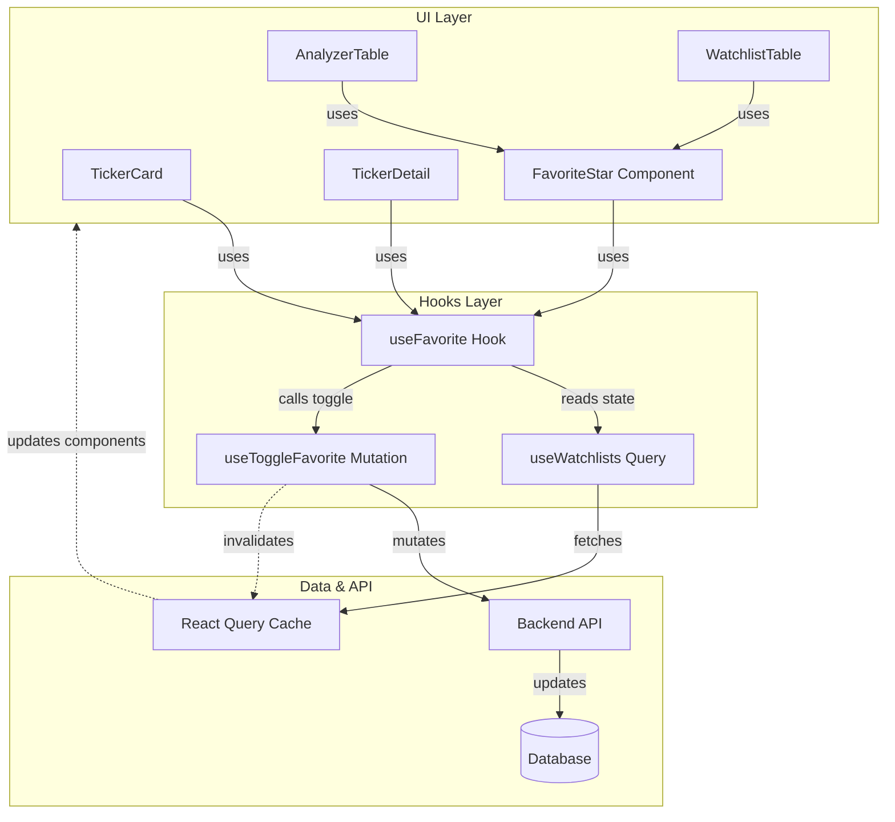
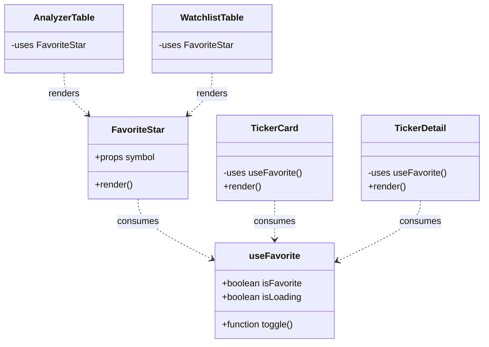

# Favorites System Architecture

This document outlines the architecture of the centralized "Favorites" feature in the Neural Ticker Core application. The goal of this architecture is to provide a unified, robust, and consistent way to manage favorite tickers across various views (Dashboard, Watchlist, Analyzer, Ticker Details) without duplicating logic or state.

## Core Design Principles

1.  **Single Source of Truth**: The "Favorites" state is derived directly from the user's "Favourites" watchlist.
2.  **Centralized Logic**: All state management and API interactions are encapsulated in the [useFavorite](file:///Users/branislavlang/Documents/GitHub/neural-ticket-core/frontend/src/hooks/useWatchlist.ts#196-217) hook.
3.  **Reusable UI**: The visual representation and interaction are encapsulated in the `<FavoriteStar />` component.
4.  **Optimistic Updates**: (Planned/Implicit) The UI reacts immediately while the background mutation processes.

## Architecture Diagrams

### 1. Data Flow & State Management

This diagram illustrates how the [useFavorite](file:///Users/branislavlang/Documents/GitHub/neural-ticket-core/frontend/src/hooks/useWatchlist.ts#196-217) hook acts as the central mediator between UI components and the Backend API/Cache.



### 2. Component Hierarchy & Integration

How the centralized logic is integrated into different parts of the application.



## Implementation Details

### The [useFavorite](file:///Users/branislavlang/Documents/GitHub/neural-ticket-core/frontend/src/hooks/useWatchlist.ts#196-217) Hook

Located in [frontend/src/hooks/useWatchlist.ts](file:///Users/branislavlang/Documents/GitHub/neural-ticket-core/frontend/src/hooks/useWatchlist.ts).

```typescript
export function useFavorite(symbol?: string) {
  // 1. Get all watchlists from cache
  const { data: watchlists = [] } = useWatchlists();
  
  // 2. Derive isFavorite state
  // Checks if the symbol exists in any watchlist (or specifically 'Favourites' if enforced)
  const isFavorite = !!symbol && watchlists.some(wl =>
    wl.items?.some(item => item.ticker.symbol === symbol)
  );

  // 3. Toggle Mutation
  const toggleMutation = useToggleFavorite();

  const toggle = (e?: React.MouseEvent) => {
    if (e) e.stopPropagation();
    if (symbol) toggleMutation.mutate(symbol);
  };

  return { isFavorite, toggle, isLoading: toggleMutation.isPending };
}
```

### The [FavoriteStar](file:///Users/branislavlang/Documents/GitHub/neural-ticket-core/frontend/src/components/watchlist/FavoriteStar.tsx#12-33) Component

Located in [frontend/src/components/watchlist/FavoriteStar.tsx](file:///Users/branislavlang/Documents/GitHub/neural-ticket-core/frontend/src/components/watchlist/FavoriteStar.tsx).
A dumb presentation component that wraps the smart hook.

```tsx
export function FavoriteStar({ symbol, className }: Props) {
  const { isFavorite, toggle } = useFavorite(symbol);
  
  return (
    <div onClick={toggle} className={className}>
      <Star className={isFavorite ? "text-yellow-400 fill-yellow-400" : "text-gray-400"} />
    </div>
  );
}
```

### Usage Pattern

- **For Tables/Lists**: Use `<FavoriteStar symbol={item.symbol} />`. This is cleaner than calling hooks inside loops/callbacks.
- **For Complex Cards/Pages**: Use `const { isFavorite, toggle } = useFavorite(symbol)` to gain full control over the button styling and interaction (e.g., [TickerCard](file:///Users/branislavlang/Documents/GitHub/neural-ticket-core/frontend/src/components/ticker/TickerCard.tsx#40-264), [TickerDetail](file:///Users/branislavlang/Documents/GitHub/neural-ticket-core/frontend/src/pages/TickerDetail.tsx#81-714)).

## API Interaction

**Endpoint**: `POST /watchlists/favorites/toggle`
**Payload**: `{ symbol: string }`

**Cache Invalidation**:
Upon success, the following query keys are invalidated to ensure UI consistency:
1.  `['watchlists']`: Refreshes the list of favorites.
2.  `['tickers', 'details', symbol]`: Refreshes individual ticker data (if it contains favorite status).
