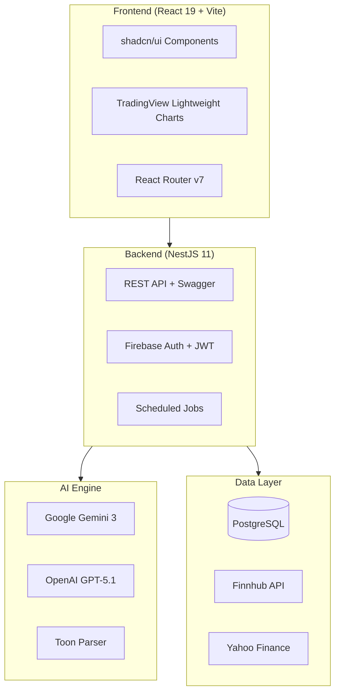
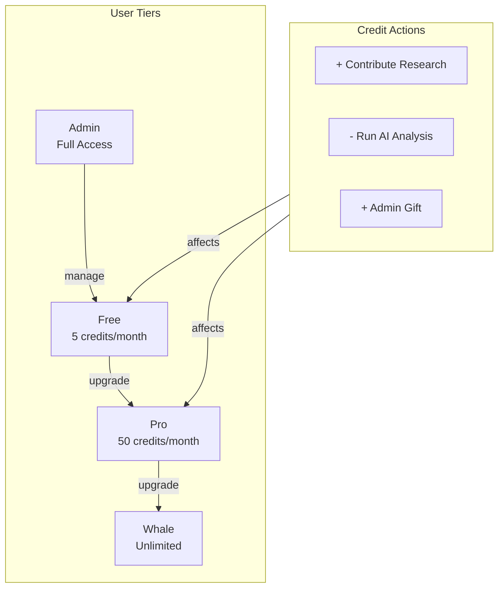
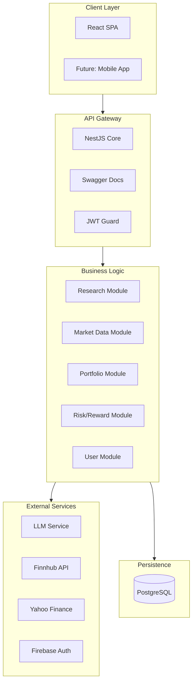
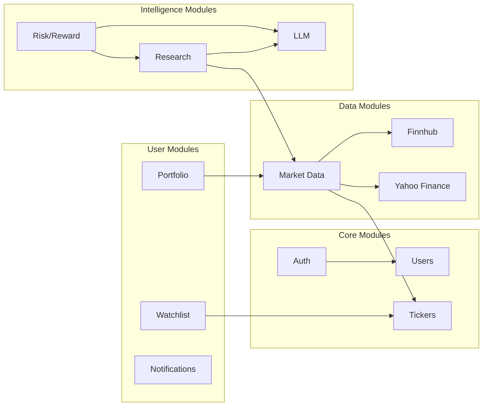
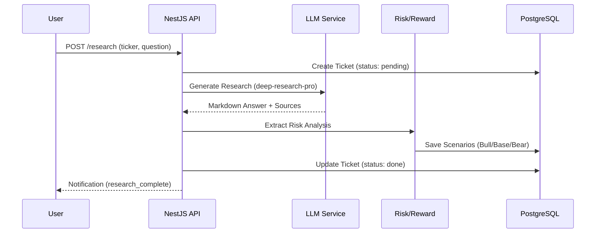
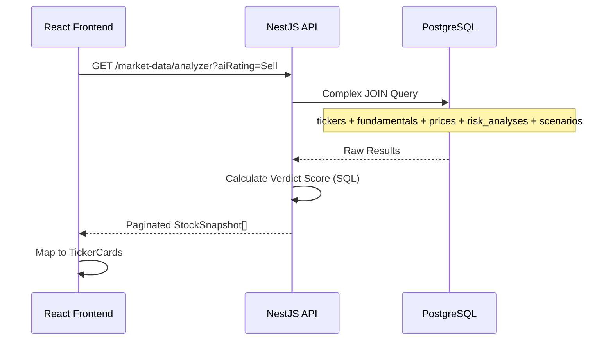

# 🧠 NeuralTicker – Business & Architecture Analysis

> **Document Type:** Strategic Business Analysis  
> **Version:** 0.3.0  
> **Last Updated:** 2026-01-14

---

## 1. Executive Summary

**NeuralTicker** is an AI-powered equity research and risk-analysis platform designed for retail and institutional investors. It bridges raw market data with actionable investment theses by leveraging Large Language Models (LLMs) to perform deep qualitative research and quantitative risk scoring.

### Core Value Proposition

| Capability | Description |
|:---|:---|
| **Autonomous Research** | Multi-minute AI investigations using Gemini/GPT-5 to analyze 10-Ks, competitive landscapes, and regulatory risks |
| **Probability-Weighted Verdicts** | Advanced scoring incorporating behavioral economics (Loss Aversion Factor 2.0x) |
| **Real-Time Market Intelligence** | Hybrid data sourcing from Finnhub and Yahoo Finance with candlestick visualizations |

---

## 2. Technology Stack Overview

| Layer | Technology | Purpose |
|:---|:---|:---|
| **Backend** | NestJS 11, TypeORM | Modular API architecture with DI |
| **Frontend** | React 19, Vite, Tailwind | Premium SPA with dark mode |
| **Database** | PostgreSQL | Relational data + JSONB for flexibility |
| **AI/ML** | Gemini 3, GPT-5.1 | Research generation, scoring, digests |
| **External APIs** | Finnhub, Yahoo Finance | Real-time prices, fundamentals, news |

---

## 3. Feature Inventory

### 3.1 Category: AI & Research 🧠

| Feature | Module | Description |
|:---|:---|:---|
| **Deep Research Agent** | [src/modules/research/research.service.ts](file:///Users/branislavlang/Documents/GitHub/neural-ticket-core/src/modules/research/research.service.ts) | Autonomous multi-minute investigations using `deep-research-pro-preview` |
| **Smart News Briefing** | [src/modules/research/research.service.ts](file:///Users/branislavlang/Documents/GitHub/neural-ticket-core/src/modules/research/research.service.ts) | AI-curated daily digests based on watchlist/portfolio |
| **Quality Scoring** | [src/modules/research/quality-scoring.service.ts](file:///Users/branislavlang/Documents/GitHub/neural-ticket-core/src/modules/research/quality-scoring.service.ts) | Automated grading of research contributions (1-10 scale) |
| **Ensemble Mode** | [src/modules/llm/llm.service.ts](file:///Users/branislavlang/Documents/GitHub/neural-ticket-core/src/modules/llm/llm.service.ts) | Run both Gemini + OpenAI, combine outputs |
| **SWOT Extraction** | [src/modules/risk-reward/risk-reward.service.ts](file:///Users/branislavlang/Documents/GitHub/neural-ticket-core/src/modules/risk-reward/risk-reward.service.ts) | Structured Strengths/Weaknesses/Opportunities/Threats |
| **Financial Extraction** | [src/modules/research/research.service.ts](file:///Users/branislavlang/Documents/GitHub/neural-ticket-core/src/modules/research/research.service.ts) | Parse analyst ratings, target prices from text |

---

### 3.2 Category: Risk & Scoring ⚖️

| Feature | Module | Description |
|:---|:---|:---|
| **Neural Rating Algorithm** | [frontend/src/lib/rating-utils.ts](file:///Users/branislavlang/Documents/GitHub/neural-ticket-core/frontend/src/lib/rating-utils.ts) | Composite score (0-100) with 6+ weighted factors |
| **Probability-Weighted Returns** | [frontend/src/lib/rating-utils.ts](file:///Users/branislavlang/Documents/GitHub/neural-ticket-core/frontend/src/lib/rating-utils.ts) | Bull/Base/Bear scenario weighting with LAF 2.0x |
| **Skew Analysis** | [frontend/src/lib/rating-utils.ts](file:///Users/branislavlang/Documents/GitHub/neural-ticket-core/frontend/src/lib/rating-utils.ts) | Risk/reward asymmetry detection |
| **Multi-Dimensional Risk** | [src/modules/risk-reward/risk-reward.service.ts](file:///Users/branislavlang/Documents/GitHub/neural-ticket-core/src/modules/risk-reward/risk-reward.service.ts) | Financial, Execution, Dilution, Competitive, Regulatory |
| **Smart News Integration** | [src/modules/market-data/market-data.service.ts](file:///Users/branislavlang/Documents/GitHub/neural-ticket-core/src/modules/market-data/market-data.service.ts) | High-impact news sentiment affects verdict |

```mermaid
flowchart LR
    subgraph Inputs["Rating Inputs"]
        UP[Upside %]
        DOWN[Downside %]
        RISK[Financial Risk 0-10]
        SCORE[Neural Score 0-10]
        CONS[Analyst Consensus]
        PE[P/E Ratio]
        NEWS[News Sentiment]
    end

    subgraph Algorithm["Weighted Verdict"]
        CALC[Composite Score 0-100]
    end

    subgraph Outputs["Verdicts"]
        SB[Strong Buy ≥80]
        BUY[Buy ≥65]
        HOLD[Hold ≥45]
        SELL[Sell <45]
        SPEC[Speculative Buy]
    end

    Inputs --> Algorithm --> Outputs
```

---

### 3.3 Category: Market Data 📊

| Feature | Module | Description |
|:---|:---|:---|
| **Stock Analyzer** | [src/modules/market-data/market-data.service.ts](file:///Users/branislavlang/Documents/GitHub/neural-ticket-core/src/modules/market-data/market-data.service.ts) | Paginated, filtered, sorted stock screener |
| **Real-Time Snapshots** | [src/modules/market-data/market-data.service.ts](file:///Users/branislavlang/Documents/GitHub/neural-ticket-core/src/modules/market-data/market-data.service.ts) | Price, fundamentals, sparklines in one call |
| **Company News** | [src/modules/market-data/market-data.service.ts](file:///Users/branislavlang/Documents/GitHub/neural-ticket-core/src/modules/market-data/market-data.service.ts) | Cached news with Finnhub + Yahoo fallback |
| **Analyst Ratings** | [src/modules/market-data/market-data.service.ts](file:///Users/branislavlang/Documents/GitHub/neural-ticket-core/src/modules/market-data/market-data.service.ts) | Deduplicated ratings from multiple sources |
| **Candlestick Charts** | `frontend/src/components/ticker/` | TradingView integration with premium styling |
| **Market Status** | `frontend/src/components/dashboard/MarketStatusBar.tsx` | Pre-market / Open / After-hours indicator |

---

### 3.4 Category: Portfolio Management 💼

| Feature | Module | Description |
|:---|:---|:---|
| **Position Tracking** | `src/modules/portfolio/portfolio.service.ts` | Add/Edit/Remove holdings with cost basis |
| **Live Valuation** | `src/modules/portfolio/portfolio.service.ts` | Real-time P&L using latest market prices |
| **AI Portfolio Analysis** | `src/modules/portfolio/portfolio.service.ts` | LLM-powered analysis based on risk appetite, horizon, goal |
| **Analysis History** | `src/modules/portfolio/portfolio.service.ts` | Persisted past analyses for comparison |

---

### 3.5 Category: User Management 👤

| Feature | Module | Description |
|:---|:---|:---|
| **Multi-Tier System** | `src/modules/users/entities/user.entity.ts` | Free → Pro → Whale tiers with credit caps |
| **Credit Economy** | `src/modules/users/credit.service.ts` | Earn via contributions, spend on research |
| **OAuth 2.0 Login** | `src/modules/auth/` | Google OAuth + Firebase Auth integration |
| **JWT Sessions** | `src/modules/auth/` | Stateless authentication with refresh tokens |
| **Admin Roles** | `src/modules/auth/jwt-auth.guard.ts` | Role-based access control for admin features |

---

### 3.6 Category: Social & Community 💬

| Feature | Module | Description |
|:---|:---|:---|
| **Ticker Discussion** | `src/modules/social/` | Comment threads per ticker |
| **Watchlists** | `src/modules/watchlist/watchlist.service.ts` | Create/manage multiple lists |
| **Favourites** | `src/modules/watchlist/watchlist.service.ts` | Quick-toggle star button |
| **StockTwits Integration** | `src/modules/stocktwits/` | Social sentiment data |
| **Notifications** | `src/modules/notifications/notifications.service.ts` | Real-time alerts via RxJS streams |

---

### 3.7 Category: Admin Console 🛡️

| Feature | Module | Description |
|:---|:---|:---|
| **User Management** | `frontend/src/pages/AdminConsole.tsx` | Approve/reject users, change tiers, gift credits |
| **Ticker Requests** | `src/modules/ticker-requests/` | Review and approve new ticker additions |
| **Shadow Banning** | `src/modules/tickers/tickers.service.ts` | Hide tickers from global search |
| **Logo Management** | `frontend/src/pages/AdminConsole.tsx` | Override ticker logos |
| **System Stats** | `frontend/src/pages/AdminConsole.tsx` | Strong Buy/Sell counts, research volume |

---

## 4. System Architecture

### 4.1 High-Level Architecture

### 4.2 Module Dependency Graph

---

## 5. Data Flow Diagrams

### 5.1 Research Pipeline

### 5.2 Stock Analyzer Query

---

## 6. API Surface Summary

| Endpoint Group | Key Endpoints | Auth Required |
|:---|:---|:---:|
| **Auth** | `POST /auth/login`, `GET /auth/me` | ✅ |
| **Tickers** | `GET /tickers`, `POST /tickers` | ✅ |
| **Market Data** | `GET /market-data/analyzer`, `GET /market-data/snapshot/:symbol` | ✅ |
| **Research** | `POST /research`, `GET /research/:id` | ✅ |
| **Portfolio** | `GET /portfolio/positions`, `POST /portfolio/analyze` | ✅ |
| **Watchlist** | `GET /watchlists`, `POST /watchlists/:id/items` | ✅ |
| **Admin** | `GET /admin/users`, `PATCH /admin/users/:id/tier` | ✅ Admin |

---

## 7. Security & Governance

| Control | Implementation |
|:---|:---|
| **Authentication** | Firebase Auth + JWT (passport-jwt) |
| **Authorization** | Role-based guards (Admin, User) |
| **Rate Limiting** | @nestjs/throttler |
| **Input Validation** | class-validator + DTOs |
| **Data Privacy** | User-scoped queries, shadow banning |
| **Audit Trail** | CreditTransaction logs, research history |

---

## 8. Appendix: Module Inventory

| Module | Files | Purpose |
|:---|:---:|:---|
| `auth` | 20 | Authentication, OAuth, JWT |
| `users` | 14 | User CRUD, credit management |
| `tickers` | 9 | Ticker registry, shadow banning |
| `market-data` | 18 | Prices, fundamentals, news, analyzer |
| `research` | 10 | AI research, digests, contributions |
| `risk-reward` | 10 | SWOT, scenarios, scoring |
| `llm` | 8 | Gemini/OpenAI providers |
| `portfolio` | 8 | Positions, AI analysis |
| `watchlist` | 7 | Lists, favourites |
| `notifications` | 4 | Real-time alerts |
| `social` | 6 | Comments, discussions |
| `jobs` | 6 | Cron jobs, scheduled tasks |
| `finnhub` | 3 | Finnhub API integration |
| `yahoo-finance` | 4 | Yahoo Finance integration |
| `stocktwits` | 7 | Social sentiment |
| `proxy` | 3 | External API proxy |
| `ticker-requests` | 5 | User ticker requests |
| `firebase` | 3 | Firebase Admin SDK |
| `health` | 3 | Health checks |

---

*Generated by Antigravity AI Agent for 404-Profit-Not-Found/neural-ticker-core*
