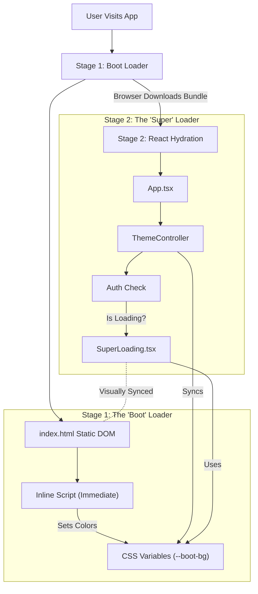

# Loader Architecture: The "Two-Stage" System

You correctly identified that we have "two" loaders, but effectively they form a **single, seamless synchronization system**.

## High-Level Architecture

We use a **Two-Stage Loading Strategy** to ensure the user *never* sees a blank white screen, even before React has downloaded.

## Why Two Versions?

We need two technical implementations to cover two different phases of the application lifecycle:

| Feature | **Boot Loader** ([index.html](file:///Users/branislavlang/Documents/GitHub/neural-ticket-core/frontend/index.html)) | **SuperLoader** ([SuperLoading.tsx](file:///Users/branislavlang/Documents/GitHub/neural-ticket-core/frontend/src/components/ui/SuperLoading.tsx)) |
| :--- | :--- | :--- |
| **Active When** | **Before** React loads (0ms - 2s) | **After** React loads (Data fetching, Auth) |
| **Tech Stack** | Pure HTML/CSS + Inline JS | React, TypeScript, Tailwind |
| **Purpose** | Prevents "Flash of White" | In-App Transitions |

## Visualization of Uniformity

Although they are two separate files, they are designed to be **visually identical**. We achieve this by sharing the exact same CSS variables for colors, backgrounds, and font styles.

### The Synchronization Bridge

1.  **Boot Phase**: [index.html](file:///Users/branislavlang/Documents/GitHub/neural-ticket-core/frontend/index.html) reads `localStorage` and sets `--boot-bg`, `--boot-text`, etc.
2.  **Handover**: React loads. The user still sees the Boot Loader until React decides what to render.
3.  **App Phase**: [SuperLoading](file:///Users/branislavlang/Documents/GitHub/neural-ticket-core/frontend/src/components/ui/SuperLoading.tsx#10-130) is rendered by React. It *consumes* the same `--boot-bg` variables.
4.  **Live Updates**: If the user changes the theme in [ThemeController](file:///Users/branislavlang/Documents/GitHub/neural-ticket-core/frontend/src/App.tsx#122-207), we update the `--boot-bg` variables in real-time, so both loaders stay in sync.

### Precision Correction (Applied)

We identified a discrepancy where [SuperLoading](file:///Users/branislavlang/Documents/GitHub/neural-ticket-core/frontend/src/components/ui/SuperLoading.tsx#10-130) was applying an extra layer of opacity (`opacity-80`) that [index.html](file:///Users/branislavlang/Documents/GitHub/neural-ticket-core/frontend/index.html) was not, causing a slight visual shift during handover.

*   **Correction**: Removed `opacity-80` from [SuperLoading.tsx](file:///Users/branislavlang/Documents/GitHub/neural-ticket-core/frontend/src/components/ui/SuperLoading.tsx).
*   **Result**: Both now use the exact alpha values defined in the theme variables (0.6 for Dark, 1.0 for Light).

## The Gray Theme Fix

The discrepancy you noticed ("different versions have different background colors") was a configuration mismatch:

*   **Boot Loader**: Was using **Slate 100** (`#f3f4f6`).
*   **App Loader**: Was sitting on the `body` background, which was **Gray 300** (`#d1d5db`).

**Resolution**: I have updated the application CSS to strictly use **Slate 100** (`#f3f4f6`) for the Gray theme background, making it 100% identical to the boot loader.

## Recommendations for Maintenance

*   **Always edit properties via CSS Variables**: Do not hardcode colors in [SuperLoading.tsx](file:///Users/branislavlang/Documents/GitHub/neural-ticket-core/frontend/src/components/ui/SuperLoading.tsx). Always use `var(--boot-...)`.
*   **Update [index.html](file:///Users/branislavlang/Documents/GitHub/neural-ticket-core/frontend/index.html) script**: If you add a new theme, you must add its color logic to the inline script in [index.html](file:///Users/branislavlang/Documents/GitHub/neural-ticket-core/frontend/index.html) AND [ThemeController](file:///Users/branislavlang/Documents/GitHub/neural-ticket-core/frontend/src/App.tsx#122-207) in [App.tsx](file:///Users/branislavlang/Documents/GitHub/neural-ticket-core/frontend/src/App.tsx).

## Auth & Logout Transitions

`SuperLoading` is used for:
- Initial session check (`ProtectedRoute` loading state)
- OAuth callback (`OAuthCallback` component)
- Any other fullscreen loading states

**Critical Requirements**:
1. All auth-related `SuperLoading` usages must set `fullScreen={true}`.
2. `SuperLoading` must be **opaque** (uses `var(--boot-bg)`), not transparent.
3. Progress bar animation must remain visible throughout (0% → 233%).

## Login Page Consistency

[Login.tsx](file:///Users/branislavlang/Documents/GitHub/neural-ticket-core/frontend/src/pages/Login.tsx) must consume `var(--boot-*)` variables to ensure it matches the Boot Loader and SuperLoading visually. Never hardcode theme colors.
