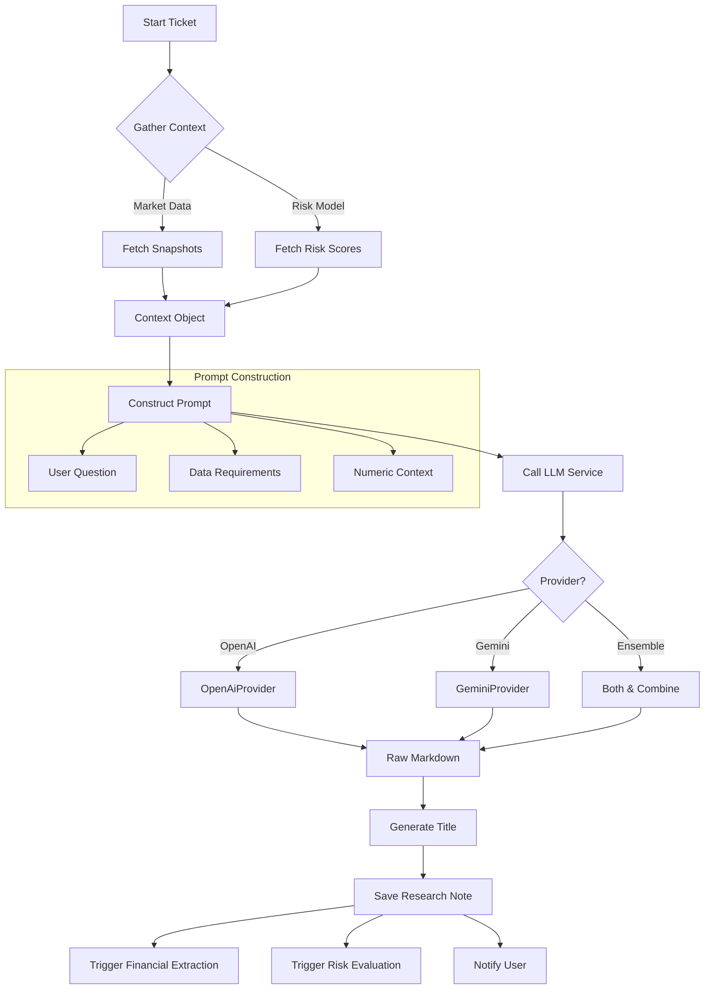
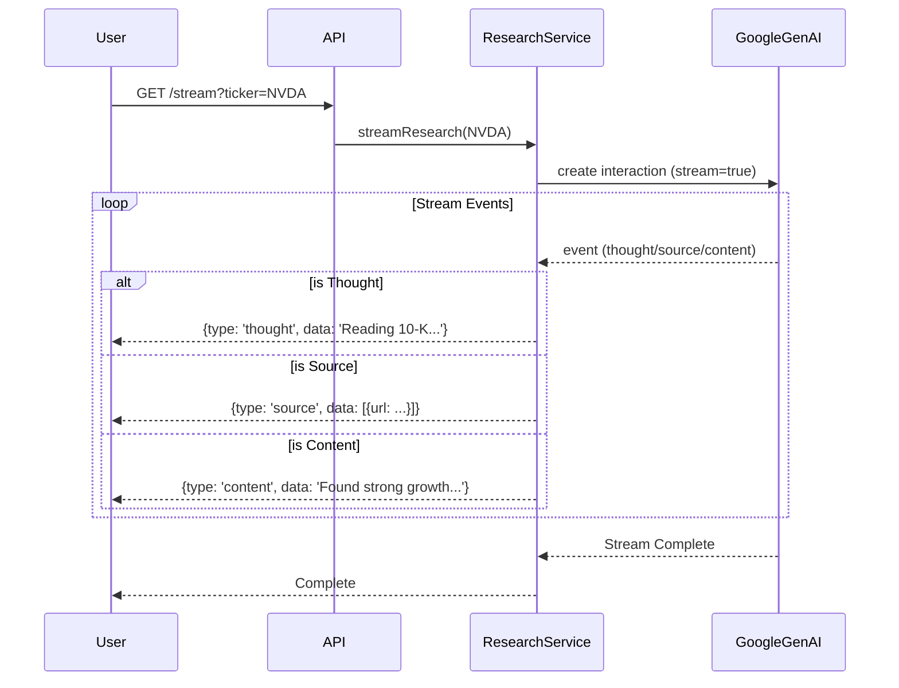

# LLM Research & Analysis Architecture

## Overview
The `Neural-Ticker` project implements a sophisticated multi-stage research pipeline that leverages Large Language Models (LLMs) to generate financial insights, extract structured data, and perform deep-dive analysis. The system supports multiple providers (OpenAI, Gemini) and includes specialized flows for streaming "Deep Research" and automated daily digests.

## Core Components

### 1. Research Orchestrator ([ResearchService](file:///c:/Users/brani/Documents/GitHub/neural-ticker-core/src/modules/research/research.service.ts#28-832))
The central hub for all research activities. It is responsible for:
- **Context Gathering**: Fetching real-time market data, risk scores, and technical indicators before calling the LLM.
- **Prompt Engineering**: Dynamic construction of prompts based on the task (Deep Dive, News Digest, Extraction).
- **Lifecycle Management**: Handling the state of research tickets (PENDING -> PROCESSING -> COMPLETED/FAILED).
- **Post-Processing**: Triggering financial extraction and risk scoring updates after the text generation is complete.

### 2. LLM Gateway ([LlmService](file:///c:/Users/brani/Documents/GitHub/neural-ticker-core/src/modules/llm/llm.service.ts#8-86))
An abstraction layer that normalizes interactions with different AI providers.
- **Providers**: 'openai', 'gemini', 'ensemble'.
- **Ensemble Mode**: Runs multiple models in parallel and combines their outputs for higher confidence.
- **Context Optimization**: Uses `toon-parser` to compress/optimize numeric context before sending it to the model.

## Research Workflows

### Standard Research Flow ([processTicket](file:///c:/Users/brani/Documents/GitHub/neural-ticker-core/src/modules/research/research.service.ts#100-251))
This is the primary background job for analyzing tickers.



### Deep Research Streaming Flow
A real-time, interactive flow using Google's GenAI "Deep Research" capabilities.



## Prompt Engineering & Validation

The system uses highly specific, structured prompts to ensure data integrity and output quality.

### 1. The Research Prompt
Used for generating main analysis. It enforces a strict structure and mandates specific financial data points.

**Key validation features:**
- **Explicit Requirements**: "You MUST search for and explicitly include..."
- **Mandated Section**: "CRITICAL SECTION REQUIREMENT" for Risk/Reward profiles.
- **Format enforcement**: Demands a specific layout for parsability.

```markdown
CRITICAL DATA REQUIREMENT:
You MUST search for and explicitly include the following TTM... [List of metrics]

CRITICAL SECTION REQUIREMENT:
You MUST include a "Risk/Reward Profile" section...
- Overall Score: [0-10]
- Financial Risk: [0-10]
...
```

### 2. The Extraction Prompt ("Flash" Model)
After the main research is generated, a second, faster ("Flash") model call extracts structured valid JSON from the narrative text.

**Validation Logic:**
- **Role Definition**: "You are a strict data extraction engine."
- **Schema Enforcement**: Defines exact keys (`pe_ttm`, `eps_ttm`) and types (`Values must be NUMBERS`).
- **Post-Processing Validation**:
    - The code uses Regex (`/```json|```/g`) to strip markdown fencing.
    - `JSON.parse` is wrapped in a try-catch block.
    - It validates the existence of `financials` and `ratings` keys before upserting to the database.

```mermaid
graph LR
    A[Research Markdown] --> B[Flash Model Prompt]
    B --> C[LLM Generation]
    C --> D[Raw JSON String]
    D --> E[Regex Cleaner]
    E --> F[JSON.parse()]
    F --> G{Valid Structure?}
    G -->|Yes| H[Upsert Database]
    G -->|No| I[Log Warning & Skip]
```

### 3. Daily Digest Prompt
Generates a "Bloomberg Terminal" style briefing.
- **Strict Rules**: "Select only TOP 3-5 stories", "No fluff".
- **Formatting**: Enforces specific markdown links `[SYMBOL](/ticker/SYMBOL)` for frontend navigation.

## Validation & resilience
1.  **Context Sanitization**: [LlmService](file:///c:/Users/brani/Documents/GitHub/neural-ticker-core/src/modules/llm/llm.service.ts#8-86) sanitizes the numeric context object (removing functions/Dates) before passing it to `toon-parser` to prevent crashes.
2.  **Ensemble Fallback**: The `ensemble` provider throws an error only if *all* sub-providers fail. If one succeeds, it returns partial results.
3.  **Stuck Ticket Cleanup**: [failStuckTickets](file:///c:/Users/brani/Documents/GitHub/neural-ticker-core/src/modules/research/research.service.ts#521-542) (Cron-like) actively monitors and fails tickets stuck in `PROCESSING` for > 20 minutes.
4.  **Error Handling**: All major LLM interactions are wrapped in try-catch blocks that log errors and update the ticket status to `FAILED` with a descriptive error message.

### Models Used
- **LlmService** abstracts multiple providers:
  - **OpenAI** – `gpt-4o` (high‑quality), `gpt-3.5-turbo` (fast fallback).
  - **Gemini** – `gemini-1.5-pro` (Google GenAI).
  - **Ensemble** – runs both OpenAI and Gemini in parallel and merges results for higher confidence.

### Prompt Examples
#### Research Prompt (primary LLM)
```markdown
You are a senior financial analyst. Generate a detailed research note for **${symbol}** covering:
- Company overview
- Recent earnings and key metrics (PE, EPS, dividend yield, market cap)
- Risk/Reward profile with scores 0‑10 for overall, financial, execution, etc.
- Include a **CRITICAL SECTION** titled "Risk/Reward Profile" with the exact fields.
- Cite sources as markdown links.
```
#### Extraction Prompt (Flash model)
```markdown
You are a strict data extraction engine. Extract the following JSON schema from the research note:
```json
{
  "financials": {"pe_ttm": number, "eps_ttm": number, "market_cap": number},
  "risk": {"overall": number, "financial": number, "execution": number},
  "scenarios": [{"type": "bull|base|bear", "price_target": number, "probability": number}]
}
```
Return only the JSON object, no extra text.
```

### Fallback & Resilience Mechanisms
- **Ensemble Fallback** – if one provider fails, the other’s result is used.
- **Retry Logic** – LlmService retries up to 2 times with exponential back‑off.
- **Stuck Ticket Cleanup** – cron job `failStuckTickets` marks tickets >20 min in `PROCESSING` as `FAILED`.
- **Context Sanitization** – numeric context is stripped of functions/Dates before feeding `toon‑parser`.

### Testing Strategy
- **Unit Tests** for `LlmService` using mocked OpenAI/Gemini clients; verify provider selection and fallback.
- **Integration Tests** for `ResearchService.processTicket` ensuring the full flow (context gathering → prompt → LLM → extraction → DB persistence).
- **Streaming Tests** for the Deep Research flow using a mock `GoogleGenAI` streaming client.
- **End‑to‑End Tests** simulate a full ticket lifecycle via HTTP API and assert final research note content.
- **Coverage** – target >90 % for LLM‑related modules.

### References
- [README.md](file:///c:/Users/brani/Documents/GitHub/neural-ticker-core/README.md)
- [Toon Migration Plan (resolved)](file:///c:/Users/brani/Documents/GitHub/neural-ticker-core/toon_migration_plan.md.resolved)
- [Research Analysis Plan](file:///c:/Users/brani/Documents/GitHub/neural-ticker-core/plans/research-analysis.md)
- [Implementation Plan](file:///c:/Users/brani/Documents/GitHub/neural-ticker-core/plans/implementation_plan.md)
- [Toon Migration Plan](file:///c:/Users/brani/Documents/GitHub/neural-ticker-core/plans/toon_migration_plan.md)
