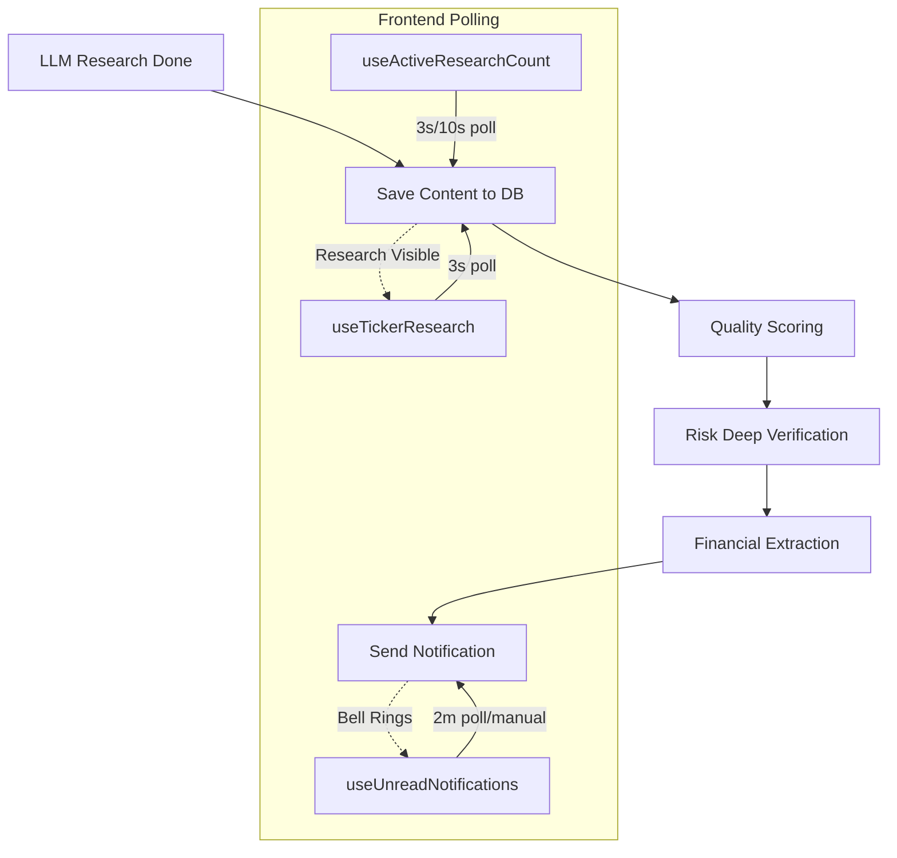

# Research & Notification Architecture

This document describes the flow of AI research requests, the "placeholder" mechanism, and how notifications are synchronized across the system.

## 1. High-Level Research Flow

The research process is asynchronous. When a user requests research, a "placeholder" ticket is created immediately, and the heavy lifting happens in the background.

```mermaid
sequenceDiagram
    participant U as User (Frontend)
    participant C as ResearchController
    participant S as ResearchService
    participant DB as Database
    participant LLM as LLM Service (Gemini/GPT)
    participant N as NotificationService

    U->>C: POST /v1/research/ask
    C->>S: createResearchTicket()
    S->>DB: Save ResearchNote (Status: PENDING)
    S-->>C: Ticket ID
    C-->>U: 201 Created (Ticket ID)

    Note over U: Frontend starts polling GET /research/:id

    C->>S: processTicket(id) (Background)
    S->>DB: Update ResearchNote (Status: PROCESSING)
    S->>LLM: Generate Research Content
    LLM-->>S: Markdown Content
    S->>S: Generate dynamic title
    S->>DB: Save ResearchNote (Status: COMPLETED, Content)
    
    rect rgb(40, 40, 60)
    Note right of S: Sequential Post-Processing (Bottleneck)
    S->>S: Quality Scoring
    S->>S: Risk Verification (Deep Score)
    S->>S: Financial Extraction
    end

    S->>N: create(user_id, 'research_complete')
    N->>DB: Save Notification
    
    Note over U: Poll catches COMPLETED status
    U->>U: UI Replaces "Pulse" with Content
```

## 2. The Placeholder Mechanism

### How it works:
1.  **Creation**: A [ResearchNote](file:///c:/Users/brani/Documents/GitHub/neural-ticker-core/frontend/src/pages/ResearchPage.tsx#33-57) record is inserted with `status: 'pending'` or `'processing'`.
2.  **Frontend View**: The [ResearchFeed](file:///c:/Users/brani/Documents/GitHub/neural-ticker-core/frontend/src/components/ticker/ResearchFeed.tsx#31-275) component queries the list of research. Any item with a pending/processing status is rendered as a "pulse" dot with the text "Preparing research...".
3.  **Replacement**: When the background task finishes, it updates the **same record** in the database. 
4.  **Finalization**: The next poll from the frontend receives the updated record with `status: 'completed'` and the full `answer_markdown`. The UI React state updates, and the "pulse" is replaced by the actual title and content link.

## 3. Notification Synchronization

### The "Lag" Issue
Notifications are tied to the conclusion of the research *including* post-processing.

**Current Issues:**
- **Sequential Delay**: The notification is sent *after* Financial Extraction and Risk Verification. If these steps are slow, the user might see the "Completed" research via polling 30 seconds before the notification arrives.
- **Polling Frequency**: The frontend polls every 3 seconds. The header indicator polls independently every 10 seconds (or 3s if active). This lack of real-time push (WebSockets) causes the perceived "desync".

### Notification Dependency Chain

## 4. Performance & Sync Audit

| Factor | Current State | Impact |
| :--- | :--- | :--- |
| **Notification Timing** | Sent after all post-processing. | Notification feels "late" compared to UI data. |
| **Sync Mechanism** | Pull-based (Polling). | Latency of up to 10 seconds for global status. |
| **Bottle Neck** | Sequential execution in [processTicket](file:///c:/Users/brani/Documents/GitHub/neural-ticker-core/src/modules/research/research.service.ts#167-342). | Total research time is the SUM of all steps. |
| **Placeholder Replacement** | atomic DB update. | Robust, but UI transition depends on poll timing. |

## 5. Recommended Optimizations

1.  **Parallelize Post-Processing**: Run Quality Scoring and Financial Extraction in parallel with Title Generation.
2.  **Early Notification**: Move the notification trigger immediately after the LLM content is saved to the DB, but *before* long-running data extractions.
3.  **Real-Time Bridge**: Implement Socket.IO or reuse the SSE logic for research status updates to eliminate polling latency.
4.  **Lazy Extraction**: Extract financials on-demand or as a separate non-blocking worker task.
