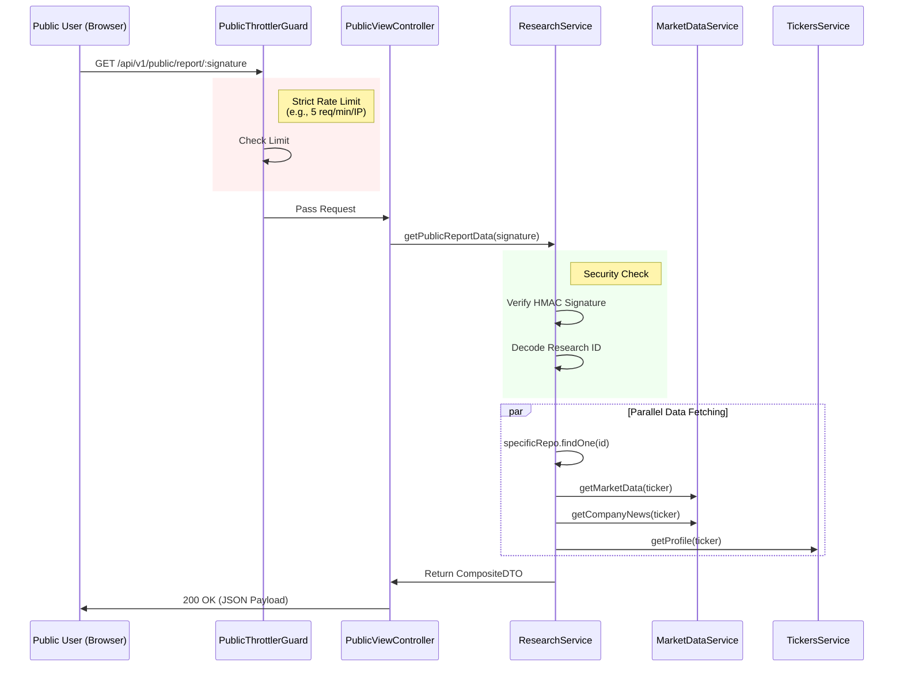
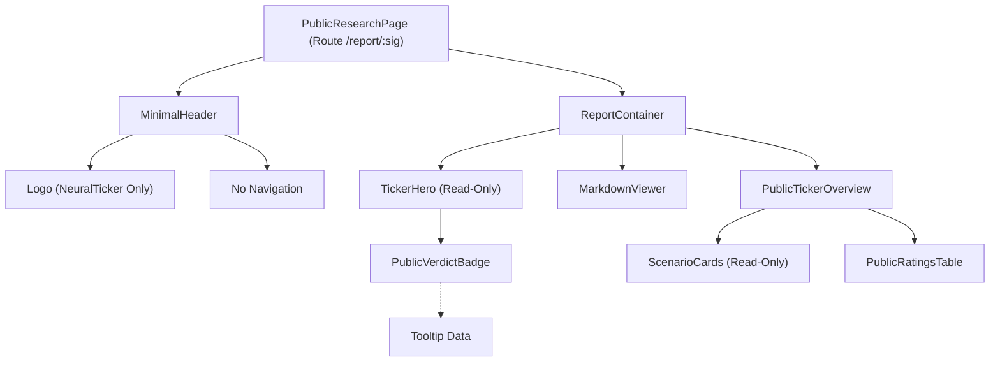

# Architecture Proposal: Secure Read-Only Shareable View

## Executive Summary
This document outlines the architectural design for a secure, high-performance, and publicly accessible "Read-Only View" for NeuralTicker research notes. The primary goals are **Security** (prevention of scraping/abuse), **Performance** (instant load times), and **User Experience** (minimalist, focused UI).

## 1. System Architecture

The solution utilizes a **Composite Public Endpoint** pattern to deliver all necessary data in a single request, minimizing client-side latency and exposure surface.

### 1.1 High-Level Data Flow



## 2. Security Architecture

### 2.1 Cryptographic Signatures (HMAC)
Instead of exposing raw UUIDs (e.g., `/report/123-abc`), we will use signed hashes.
*   **Mechanism**: `HMAC-SHA256(research_id + USER_PROVIDED_SECRET)`
*   **Secret Source**: `process.env.RESEARCH_SHARE_SECRET` (Must be set in `.env`).
*   **Benefit**: Prevents ID enumeration attacks. Users cannot simply "guess" the next report ID.
*   **Validation**: The backend re-computes the hash upon receipt. If it doesn't match, the request takes constant time to fail (preventing timing attacks) and returns `403 Forbidden`.

### 2.2 Strict Abuse Prevention
A dedicated `PublicThrottlerGuard` will be implemented specifically for this controller.
*   **Limit**: 10 requests per minute per IP (strict).
*   **Scope**: Isolated from the main API throttling (which is looser for authenticated users).
*   **Response**: `429 Too Many Requests`.

## 3. Data Schema: The Composite Payload

To achieve "instant" loading performance and **Full Overview Parity**, we merge comprehensive data sources into one DTO:

```typescript
interface PublicReportResponse {
  // From ResearchService
  note: {
    id: string;
    title: string;
    content: string; // Markdown
    created_at: string;
    models_used: string[];
    rarity: string;
    // ...other safe fields
  };
  
  // From TickerService
  profile: {
    symbol: string;
    name: string;
    logo_url: string;
    industry: string;
    description: string; // "About Company"
    web_url: string;
    exchange: string;
  };
  
  // From MarketDataService
  market_context: {
    price: number;
    change_percent: number;
    history: PricePoint[]; // For "Price Chart"
  };
  
  // Risk & Scenarios
  risk_analysis: {
    overall_score: number;
    summary: string;
    sentiment: 'BULLISH' | 'BEARISH' | 'NEUTRAL';
    financial_risk: number;
    // ... other risk metrics for VerdictBadge tooltip
    scenarios: Scenario[]; // For "Price Scenarios"
    red_flags: string[];
    catalysts: Catalyst[];
  };

  // Extra Context
  ratings: AnalystRating[]; // For "Analyst Ratings"
  news: NewsItem; // For "Market Update"
  fundamentals: Fundamentals; // For "About" context
}
```

## 4. Frontend Architecture (React)

### 4.1 Component Architecture
The frontend utilizes a "Container-Presenter" pattern where `PublicResearchPage` acts as the single source of truth/container.
**CRITICAL**: To comply with "Zero-Touch" policy, we will create **Parallel Components** for the public view (e.g., `PublicTickerOverview.tsx`) rather than modifying existing files.



### 4.2 Feature Parity & Interactions ("Read-Only Mode")

#### **PublicVerdictBadge**
*   **Strategy**: Create `src/components/public/PublicVerdictBadge.tsx` (copy of original).
*   **Behavior**: Hardcoded to non-interactive mode. No navigation logic. Tooltips **ENABLED**.
*   **Data Source**: All risk scores required for the tooltip are pre-loaded in the `risk_analysis` chunk.

#### **PublicTickerOverview**
*   **Strategy**: Create `src/components/public/PublicTickerOverview.tsx` (copy of original).
*   **Modifications for Public View**:
    *   **News Card**: Static text only. No internal links.
    *   **About Section**: Standard rendering.
    *   **Price Scenarios**: Reused (safe).
    *   **Analyst Ratings**: Copied to `PublicRatingsTable` to remove any potential profile links.
    *   **Zero Dependencies on Auth**: All imports related to `ActionButtons`, `Favorites`, or `Comments` are removed.

#### **Charts**
*   **Price Chart**: Included in the view using `recharts`. Data is supplied via `market_context.history`.

## 5. Planned Features & Design
The shareable view will essentially mirror the **Overview Tab** of the `TickerDetail` page, minus the write-heavy interactions.

| Feature Area | Component | Read-Only Adaptation |
| :--- | :--- | :--- |
| **Header** | `MinimalHeader` | New component. Logo only. No search/menues. |
| **Hero Section** | `TickerHero` | Same visual impact. No "Star", "Sync", or "Share" buttons. |
| **Verdict** | `VerdictBadge` | Interactive tooltip enabled. No click-to-navigate. |
| **Research Note** | `MarkdownViewer` | Full markdown rendering of the AI thesis. |
| **Price Scenarios** | `ScenarioCards` | Fully visible. No changes needed. |
| **Company Info** | `TickerOverview` | Fully visible description & industry tags. |
| **Market Update** | `NewsCard` | Show latest news item. Remove "View Source" if internal. |
| **Analyst Ratings** | `RatingsTable` | Fully visible table. |

## 6. Verification & Testing Strategy

### 5.1 Unit Tests (Jest)

#### Backend
1.  **`PublicViewController`**:
    *   `should return 200 and data for valid signature`
    *   `should return 403 Forbidden for tampered signature`
2.  **`PublicThrottlerGuard`**:
    *   `should block 11th request with 429`
3.  **`ResearchService.mergePublicData`**:
    *   `should combine Note + Profile + Market + Risks + Ratings`

#### Frontend
1.  **`VerdictBadge`**:
    *   `should render tooltip content even when readOnly=true`
    *   `should NOT trigger onClick when readOnly=true`
2.  **`PublicResearchPage`**:
    *   `should render TickerOverview with full data`
    *   `should match snapshot of Overview Tab layout`

### 5.2 End-to-End (E2E) Tests

1.  **Full Data Check**: Verify that a shared link displays the Chart, Risk Scenarios, and Analyst Ratings.
2.  **Tooltip Interaction**: Hover over the Verdict Badge on the public page -> Confirm tooltip appears with risk breakdown.
3.  **Link Safety**: Click on "Website" in About section -> Should open external tab. Click on "News" -> Should NOT navigate internally.

---
**Status**: Proposal Ready for Implementation.
