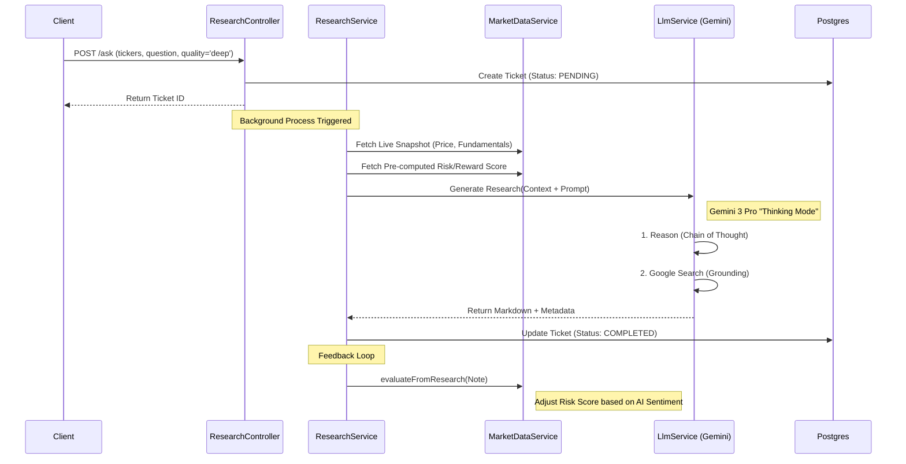

# Neural-Ticker AI Research Architecture

## 1. High-Level Concept
The AI Research module acts as an autonomous **"Financial Analyst Agent"**. It does not merely summarize text; it combines real-time quantitative market data with qualitative "Chain of Thought" reasoning to produce institutional-grade research notes.

## 2. Event-Driven Architecture (Async Flow)
To handle the complexity of "Deep Thinking" models (which can take 60+ seconds), the system uses an asynchronous job queue pattern.



## 3. The "Thinking" Engine (Gemini 2.5/3.0)
We utilize the latest **Google GenAI SDK** to unlock "System 2" thinking capabilities.

| Quality Tier | Model ID | Capabilities | Use Case |
|:--- |:--- |:--- |:--- |
| **Deep** | `gemini-3-pro-preview` | **High-Level Thinking**, Search Grounding | Earnings Analysis, Forensic Accounting |
| **High** | `gemini-2.0-flash-thinking` | Chain of Thought, Moderate Speed | Daily Market Updates, Sector Rotation |
| **Medium** | `gemini-2.0-flash` | Standard Reasoning | Quick Summaries, Sentiment Checks |

### Key Features Implemented:
1.  **Thinking Config**: We explicitly configure `thinkingLevel: HIGH` or `thinkingBudget: 1024` tokens to force the model to plan its analysis before generating the report.
2.  **Native Grounding**: We use the native `{ googleSearch: {} }` tool, allowing the model to fact-check its internal knowledge against real-time web results (unlike standard GPT-4).
3.  **Toon Parser**: A JSON optimization layer that strips unnecessary tokens from financial data before sending it to the context window.

## 4. Context Injection Strategy
We do not ask the AI to "guess" the price. We inject a **Hard Numerical Context** into the system prompt:

```json
{
  "NVDA": {
    "price": 145.20,
    "change": 2.5,
    "fundamentals": { "pe": 45.2, "market_cap": "3.5T" },
    "risk_reward": {
      "score": 8.5,
      "upside": "15%",
      "scenarios": [
        { "type": "bull", "target": 180 },
        { "type": "bear", "target": 110 }
      ]
    }
  }
}
```
*System Prompt:* `"You are a financial analyst. Use the provided Numeric Context as the absolute truth for valuation data. Do not hallucinate prices."`

## 5. Quantitative-Qualitative Feedback Loop
Uniquely, our architecture features a bi-directional flow:
1.  **Quant -> Qual**: Risk Scores feed the AI context.
2.  **Qual -> Quant**: The generated Research Note is parsed to extract a "Sentiment Score", which is then written back to the Risk/Reward engine to adjust the final `Neural Rating`.
