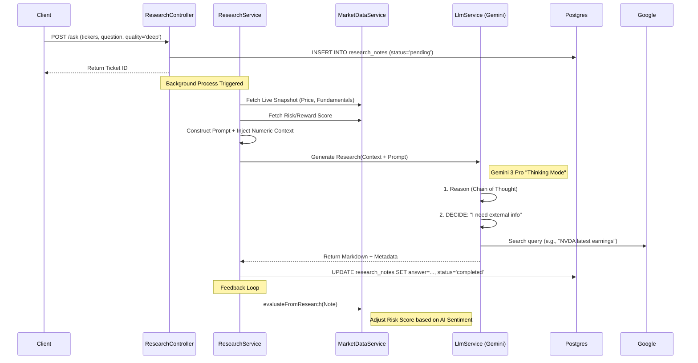

# Neural-Ticker AI Research Architecture

## 1. High-Level Concept
The AI Research module acts as an autonomous **"Financial Analyst Agent"**. It combines real-time quantitative market data with qualitative "Chain of Thought" reasoning to produce institutional-grade research notes.

> [!IMPORTANT]
> **Current Limitation**: The system currently relies on **Price/Fundamentals** and **Google Search** (via the LLM) for context. Integration with **News** and **StockTwits** APIs is planned for the next iteration to provide social sentiment analysis.

## 2. Data Flow & Storage

The system uses an **Async Job Queue** pattern. Long-running inference (which can take 60s+ for generic "Deep" thinking) is decoupled from the Rest API.

### 2.1 Database Schema (`research_notes` table)
All inputs and outputs are persisted to PostgreSQL for auditability and history.

| Column | Type | Description |
|:--- |:--- |:--- |
| [id](file:///c:/Users/brani/Documents/GitHub/neural-ticker-core/src/modules/auth/strategies/google.strategy.ts#29-42) | `UUID` | Unique Ticket ID. |
| `status` | `ENUM` | `pending` -> `processing` -> `completed` / `failed` |
| `tickers` | `TEXT[]` | List of symbols (e.g., `['NVDA', 'AMD']`) |
| `question` | `TEXT` | The user's prompt. |
| `answer_markdown` | `TEXT` | The final generated report. |
| `numeric_context` | `JSONB` | **Snapshot** of the exact data fed to the AI at runtime. |
| `models_used` | `TEXT[]` | Traceability of which model(s) generated the response. |

### 2.2 Execution Flow

## 3. The "Thinking" Engine (Gemini 2.5/3.0)
We utilize the latest **Google GenAI SDK** to unlock "System 2" thinking capabilities.

| Quality Tier | Model ID | Capabilities | Use Case |
|:--- |:--- |:--- |:--- |
| **Deep** | `gemini-3-pro-preview` | **High-Level Thinking**, Search Grounding | Earnings Analysis, Forensic Accounting |
| **High** | `gemini-2.0-flash-thinking` | Chain of Thought, Moderate Speed | Daily Market Updates, Sector Rotation |
| **Medium** | `gemini-2.0-flash` | Standard Reasoning | Quick Summaries, Sentiment Checks |

### 3.1 Google Search Integration
Google Search is not pre-fetched by our backend. Instead, it is exposed as a **Native Tool** to the LLM. 
- **Mechanism**: We pass `{ googleSearch: {} }` in the tool configuration.
- **Decision**: The Model *decides* when to search based on the user's question.
- **Benefit**: This allows the AI to find very specific, up-to-the-minute info (e.g., "Why is stock X down 5% today?") that is not available in our structured market data APIs.

## 4. Context Injection Strategy
We strictly separate **Facts** (Injected by System) vs **Reasoning** (Generated by AI).

### Injected Data (The "Truth"):
The `numeric_context` JSON field is injected into the System Prompt.
- **Market Data**: Last Price, Change %, Volume (Source: Finnhub/Polygon)
- **Fundamentals**: P/E Ratio, Market Cap, Sector.
- **Risk Analysis**: Pre-calculated quant scores (R/R Ratio, Volatility).

### Planned Data Sources (Not yet implemented):
- **News API**: Headlines and summaries.
- **StockTwits**: Social sentiment stream.

## 5. Quantitative-Qualitative Feedback Loop
Uniquely, our architecture features a bi-directional flow:
1.  **Quant -> Qual**: Risk Scores feed the AI request context.
2.  **Qual -> Quant**: The generated Research Note is parsed to extract a "Sentiment Score", which is then written back to the Risk/Reward engine to modify the final `Neural Rating` (e.g., a "Sell" rated stock might get bumped to "Hold" if the AI finds a hidden catalyst).
