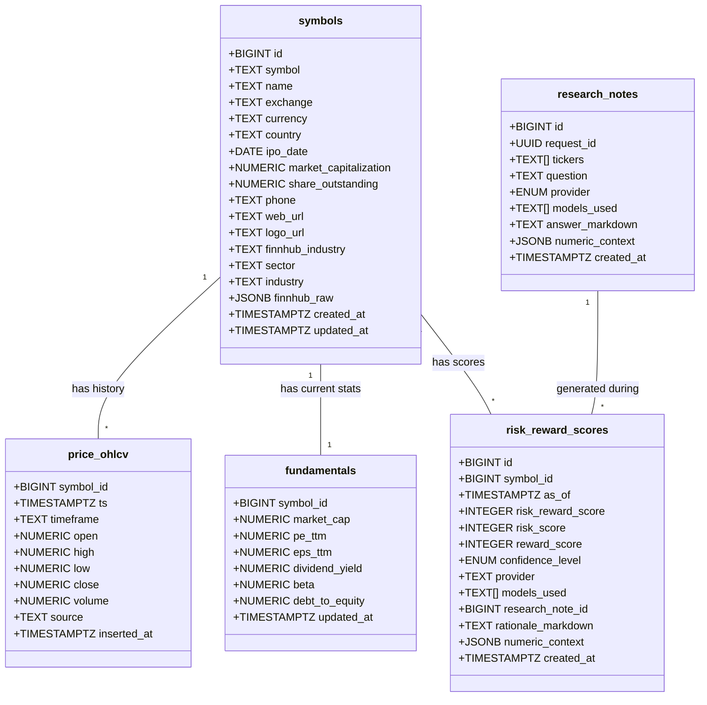

# Database Architecture

## Data Model Class Diagram

```mermaid
classDiagram
    direction TB

    class symbols {
        +BIGINT id
        +TEXT symbol
        +TEXT name
        +TEXT exchange
        +TEXT currency
        +TEXT country
        +DATE ipo_date
        +NUMERIC market_capitalization
        +NUMERIC share_outstanding
        +TEXT phone
        +TEXT web_url
        +TEXT logo_url
        +TEXT finnhub_industry
        +TEXT sector
        +TEXT industry
        +JSONB finnhub_raw
        +TIMESTAMPTZ created_at
        +TIMESTAMPTZ updated_at
    }

    class price_ohlcv {
        +BIGINT symbol_id
        +TIMESTAMPTZ ts
        +TEXT timeframe
        +NUMERIC open
        +NUMERIC high
        +NUMERIC low
        +NUMERIC close
        +NUMERIC volume
        +TEXT source
        +TIMESTAMPTZ inserted_at
    }

    class fundamentals {
        +BIGINT symbol_id
        +NUMERIC market_cap
        +NUMERIC pe_ttm
        +NUMERIC eps_ttm
        +NUMERIC dividend_yield
        +NUMERIC beta
        +NUMERIC debt_to_equity
        +TIMESTAMPTZ updated_at
    }

    class research_notes {
        +BIGINT id
        +UUID request_id
        +TEXT[] tickers
        +TEXT question
        +ENUM provider
        +TEXT[] models_used
        +TEXT answer_markdown
        +JSONB numeric_context
        +TIMESTAMPTZ created_at
    }

    class risk_reward_scores {
        +BIGINT id
        +BIGINT symbol_id
        +TIMESTAMPTZ as_of
        +INTEGER risk_reward_score
        +INTEGER risk_score
        +INTEGER reward_score
        +ENUM confidence_level
        +TEXT provider
        +TEXT[] models_used
        +BIGINT research_note_id
        +TEXT rationale_markdown
        +JSONB numeric_context
        +TIMESTAMPTZ created_at
    }

    %% Relationships
    symbols "1" -- "*" price_ohlcv : has history
    symbols "1" -- "1" fundamentals : has current stats
    symbols "1" -- "*" risk_reward_scores : has scores
    research_notes "1" -- "*" risk_reward_scores : generated during
```
