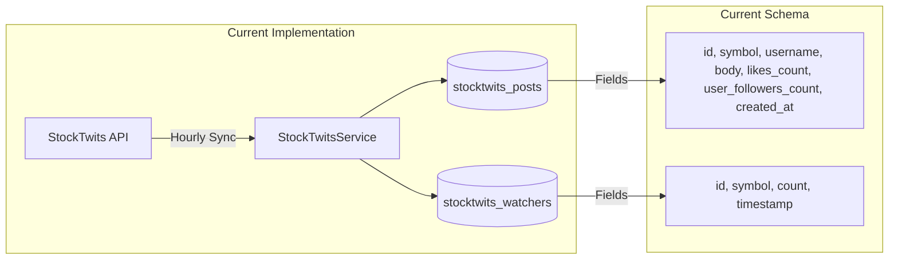
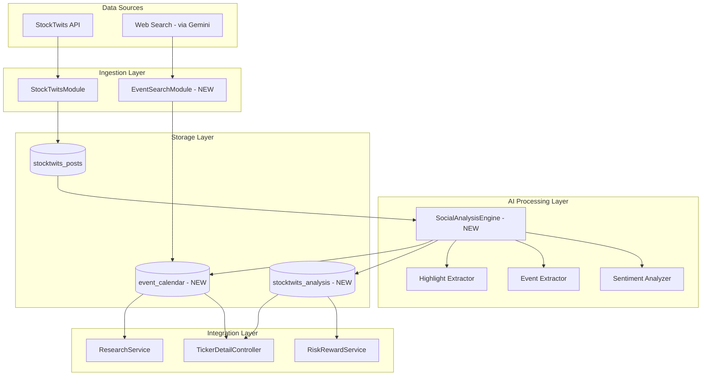

# StockTwits AI Sentiment Analysis & Event Calendar Architecture

## Overview

This document outlines the architectural design for integrating StockTwits comments into Neural-Ticker's stock analysis system. The goal is to leverage AI to extract actionable insights, sentiment signals, and upcoming events/catalysts from social commentary.

> [!IMPORTANT]
> This is an **architectural planning document** for review. Implementation will follow after approval of the proposed approach.

---

## 1. Current State Analysis

### 1.1 Existing StockTwits Infrastructure



**Current Capabilities:**
- Fetches posts from `https://api.stocktwits.com/api/2/streams/symbol/{symbol}.json`
- Stores raw post data: id, symbol, username, body, likes_count, user_followers_count
- Tracks watcher count history (social interest metric)
- Cron jobs: hourly post sync, daily watcher count sync

**Current Limitations:**
- No sentiment analysis
- No event extraction
- No AI integration
- Posts are stored but not analyzed

### 1.2 Existing AI Infrastructure

| Component | Purpose | Models Used |
|-----------|---------|-------------|
| [gemini.provider.ts](file:///c:/Users/brani/Documents/GitHub/neural-ticker-core/src/modules/llm/providers/gemini.provider.ts) | LLM interface with Google Search grounding | `gemini-3-pro-preview`, `gemini-3-flash-preview` |
| [research.service.ts](file:///c:/Users/brani/Documents/GitHub/neural-ticker-core/src/modules/research/research.service.ts) | Research note generation | Deep Research Agent |
| [risk-reward.service.ts](file:///c:/Users/brani/Documents/GitHub/neural-ticker-core/src/modules/risk-reward/risk-reward.service.ts) | Risk analysis & catalyst extraction | Extraction model |

---

## 2. Proposed Architecture

### 2.1 High-Level Design



### 2.2 New Components

#### 2.2.1 SocialAnalysisEngine (New Module)

**Purpose:** Orchestrates AI-powered analysis of StockTwits posts

**Responsibilities:**
1. **Batch Processing:** Analyze accumulated posts in configurable batches
2. **Sentiment Extraction:** Calculate overall and post-level sentiment
3. **Highlight Extraction:** Identify most valuable insights
4. **Event Detection:** Extract mentioned catalysts and dates
5. **Influence Weighting:** Prioritize posts from high-follower accounts

#### 2.2.2 EventCalendarService (New Module)

**Purpose:** Aggregates events from multiple sources into a unified calendar

**Sources:**
- StockTwits posts (AI-extracted)
- Gemini web search (scheduled queries)
- Existing RiskCatalyst entries

---

## 3. Detailed Design

### 3.1 New Entity: `StockTwitsAnalysis`

```typescript
// src/modules/stocktwits/entities/stocktwits-analysis.entity.ts

import {
  Entity,
  PrimaryGeneratedColumn,
  Column,
  ManyToOne,
  JoinColumn,
  CreateDateColumn,
  Index,
} from 'typeorm';
import { ApiProperty } from '@nestjs/swagger';
import { TickerEntity } from '../../tickers/entities/ticker.entity';

@Entity('stocktwits_analyses')
export class StockTwitsAnalysis {
  @ApiProperty({ example: 'uuid-v4' })
  @PrimaryGeneratedColumn('uuid')
  id: string;

  // --- Foreign Key to Ticker ---
  @ApiProperty({ example: '1' })
  @Column({ type: 'bigint' })
  ticker_id: string;

  @ManyToOne(() => TickerEntity, { onDelete: 'CASCADE' })
  @JoinColumn({ name: 'ticker_id' })
  ticker: TickerEntity;

  // Denormalized for query performance (indexed)
  @ApiProperty({ example: 'AAPL' })
  @Index()
  @Column()
  symbol: string;

  // Time window analyzed
  @ApiProperty({ example: '2025-01-01T00:00:00Z' })
  @Column({ type: 'timestamptz' })
  analysis_start: Date;

  @ApiProperty({ example: '2025-01-01T04:00:00Z' })
  @Column({ type: 'timestamptz' })
  analysis_end: Date;

  // Aggregate Sentiment (-1.0 to 1.0)
  @ApiProperty({ example: 0.65, description: 'Sentiment score from -1.0 (bearish) to 1.0 (bullish)' })
  @Column({ type: 'numeric', precision: 4, scale: 3 })
  sentiment_score: number;

  // Sentiment label: 'VERY_BULLISH' | 'BULLISH' | 'NEUTRAL' | 'BEARISH' | 'VERY_BEARISH'
  @ApiProperty({ example: 'BULLISH', enum: ['VERY_BULLISH', 'BULLISH', 'NEUTRAL', 'BEARISH', 'VERY_BEARISH'] })
  @Column({ type: 'text' })
  sentiment_label: string;

  // Number of posts analyzed
  @ApiProperty({ example: 42 })
  @Column({ type: 'int' })
  posts_analyzed: number;

  // Weighted by follower influence
  @ApiProperty({ example: 0.72, description: 'Follower-weighted sentiment score' })
  @Column({ type: 'numeric', precision: 4, scale: 3 })
  weighted_sentiment_score: number;

  // AI-generated summary (1-2 paragraphs)
  @ApiProperty({ example: 'Social sentiment is predominantly bullish...' })
  @Column({ type: 'text' })
  summary: string;

  // Top highlights (AI-extracted key points)
  @ApiProperty()
  @Column({ type: 'jsonb' })
  highlights: {
    text: string;
    post_id: number;
    username: string;
    followers: number;
    sentiment: 'bullish' | 'bearish' | 'neutral';
    confidence: number;
  }[];

  // Extracted events/catalysts
  @ApiProperty()
  @Column({ type: 'jsonb' })
  extracted_events: {
    description: string;
    date: string | null; // ISO date or null if unknown
    type: 'earnings' | 'fda' | 'conference' | 'product' | 'lawsuit' | 'other';
    source_post_ids: number[];
  }[];

  // Model metadata
  @ApiProperty({ example: 'gemini-2.5-flash-lite' })
  @Column({ type: 'text' })
  model_used: string;

  @ApiProperty()
  @CreateDateColumn({ type: 'timestamptz' })
  created_at: Date;
}
```

### 3.2 New Entity: `EventCalendar`

```typescript
// src/modules/events/entities/event-calendar.entity.ts

import {
  Entity,
  PrimaryGeneratedColumn,
  Column,
  ManyToOne,
  JoinColumn,
  CreateDateColumn,
  UpdateDateColumn,
  Index,
} from 'typeorm';
import { ApiProperty } from '@nestjs/swagger';
import { TickerEntity } from '../../tickers/entities/ticker.entity';

export enum EventSource {
  STOCKTWITS = 'stocktwits',
  AI_SEARCH = 'ai_search',
  RISK_ANALYSIS = 'risk_analysis',
  MANUAL = 'manual',
}

export enum EventType {
  EARNINGS = 'earnings',
  FDA_DECISION = 'fda_decision',
  CONFERENCE = 'conference',
  PRODUCT_LAUNCH = 'product_launch',
  LEGAL = 'legal',
  REGULATORY = 'regulatory',
  ANALYST = 'analyst',
  OTHER = 'other',
}

@Entity('event_calendar')
export class EventCalendar {
  @ApiProperty({ example: 'uuid-v4' })
  @PrimaryGeneratedColumn('uuid')
  id: string;

  // --- Foreign Key to Ticker ---
  @ApiProperty({ example: '1' })
  @Column({ type: 'bigint' })
  ticker_id: string;

  @ManyToOne(() => TickerEntity, { onDelete: 'CASCADE' })
  @JoinColumn({ name: 'ticker_id' })
  ticker: TickerEntity;

  // Denormalized for query performance (indexed)
  @ApiProperty({ example: 'AAPL' })
  @Index()
  @Column()
  symbol: string;

  @ApiProperty({ example: 'Q4 2024 Earnings Call' })
  @Column({ type: 'text' })
  title: string;

  @ApiProperty({ example: 'Apple Inc. quarterly earnings announcement and investor call' })
  @Column({ type: 'text', nullable: true })
  description: string;

  // Event date (nullable for "soon" type events)
  @ApiProperty({ example: '2025-01-30' })
  @Index()
  @Column({ type: 'date', nullable: true })
  event_date: Date;

  // For ranges or uncertain dates
  @ApiProperty({ example: 'Q1 2025', description: 'Human-readable date approximation' })
  @Column({ type: 'text', nullable: true })
  date_text: string; // e.g., "Q1 2025", "Early January"

  @ApiProperty({ enum: EventType })
  @Column({ type: 'enum', enum: EventType })
  event_type: EventType;

  @ApiProperty({ enum: EventSource })
  @Column({ type: 'enum', enum: EventSource })
  source: EventSource;

  // Confidence in date accuracy (0-1)
  @ApiProperty({ example: 0.95, description: 'Confidence in event date accuracy (0-1)' })
  @Column({ type: 'numeric', precision: 3, scale: 2, default: 1.0 })
  confidence: number;

  // Impact estimate (1-10)
  @ApiProperty({ example: 8, description: 'Estimated market impact (1-10)' })
  @Column({ type: 'int', nullable: true })
  impact_score: number;

  // Expected sentiment impact
  @ApiProperty({ example: 'positive', enum: ['positive', 'negative', 'neutral', 'uncertain'] })
  @Column({ type: 'text', nullable: true })
  expected_impact: 'positive' | 'negative' | 'neutral' | 'uncertain';

  // Source reference (post_id, research_note_id, url, etc.)
  @ApiProperty({ description: 'Source-specific reference data' })
  @Column({ type: 'jsonb', nullable: true })
  source_reference: Record<string, any>;

  @ApiProperty()
  @CreateDateColumn({ type: 'timestamptz' })
  created_at: Date;

  @ApiProperty()
  @UpdateDateColumn({ type: 'timestamptz' })
  updated_at: Date;
}
```

### 3.3 AI Prompt Design

#### 3.3.1 Sentiment & Highlight Extraction Prompt

```
You are analyzing StockTwits posts for ${SYMBOL}.

## Context
${POSTS_JSON}

## Instructions
Analyze these social media posts and extract:

1. **Overall Sentiment Score** (-1.0 to 1.0):
   - -1.0 = Extremely Bearish
   - 0 = Neutral
   - 1.0 = Extremely Bullish

2. **Weighted Sentiment** (factor in follower counts as credibility signal)

3. **Sentiment Label**: VERY_BULLISH | BULLISH | NEUTRAL | BEARISH | VERY_BEARISH

4. **Summary**: 1-2 paragraph synthesis of the social sentiment

5. **Top 5 Highlights**: Most insightful/influential posts
   - Prioritize: High-follower accounts, unique insights, specific catalysts

6. **Extracted Events**: Any mentioned upcoming events with dates
   - earnings, FDA decisions, conferences, product launches, etc.

## Output Format (TOON):
sentiment_score: {number}
weighted_sentiment: {number}
label: {string}
summary: {text}
highlights:
  - text: {string}
    post_id: {number}
    username: {string}
    followers: {number}
    sentiment: bullish|bearish|neutral
    confidence: {0-1}
events:
  - description: {string}
    date: {ISO date or null}
    type: earnings|fda|conference|product|lawsuit|other
    source_posts: [{ids}]
```

#### 3.3.2 Event Search Prompt (Gemini with Google Search)

```
You are a financial research assistant. Use Google Search to find upcoming events and catalysts for ${SYMBOL} (${COMPANY_NAME}).

## Search Focus
1. Earnings dates
2. FDA/regulatory decisions
3. Upcoming conferences and presentations
4. Product launches or announcements
5. Legal proceedings and deadlines
6. Analyst days and investor meetings

## Instructions
- Use your Google Search tool to find the latest information
- Focus on events within the next 90 days
- Include specific dates when available
- Note the source and confidence level

## Output Format (TOON):
events:
  - title: {string}
    description: {string}
    date: {ISO date or approximate text}
    type: earnings|fda|conference|product|legal|regulatory|analyst|other
    source_url: {url}
    confidence: high|medium|low
    expected_impact: positive|negative|neutral|uncertain
    impact_score: {1-10}
```

### 3.4 Service Architecture

#### 3.4.1 SocialAnalysisService

```typescript
// src/modules/social-analysis/social-analysis.service.ts

@Injectable()
export class SocialAnalysisService {
  constructor(
    private readonly stockTwitsService: StockTwitsService,
    private readonly llmService: LlmService,
    @InjectRepository(StockTwitsAnalysis)
    private readonly analysisRepo: Repository<StockTwitsAnalysis>,
    @InjectRepository(EventCalendar)
    private readonly eventRepo: Repository<EventCalendar>,
  ) {}

  /**
   * Analyze recent posts for a symbol.
   * Called by cron job after post sync.
   */
  async analyzeRecentPosts(symbol: string, hours: number = 24): Promise<StockTwitsAnalysis> {
    // 1. Fetch recent posts
    const posts = await this.stockTwitsService.getRecentPosts(symbol, hours);
    
    // 2. Skip if insufficient data
    if (posts.length < 5) {
      this.logger.log(`Insufficient posts for ${symbol}, skipping analysis`);
      return null;
    }
    
    // 3. Prepare prompt with post data
    const prompt = this.buildAnalysisPrompt(symbol, posts);
    
    // 4. Call LLM for analysis
    const result = await this.llmService.generate({
      question: prompt,
      quality: 'medium', // Use flash for cost efficiency
      numericContext: { posts_count: posts.length },
    });
    
    // 5. Parse and store analysis
    const analysis = this.parseAnalysisResult(symbol, result, posts);
    await this.analysisRepo.save(analysis);
    
    // 6. Upsert extracted events to calendar
    await this.upsertEvents(symbol, analysis.extracted_events);
    
    return analysis;
  }

  /**
   * Get latest sentiment for a symbol.
   */
  async getLatestSentiment(symbol: string): Promise<StockTwitsAnalysis | null> {
    return this.analysisRepo.findOne({
      where: { symbol },
      order: { created_at: 'DESC' },
    });
  }

  /**
   * Get sentiment history for charting.
   */
  async getSentimentHistory(symbol: string, days: number = 30) {
    return this.analysisRepo.find({
      where: {
        symbol,
        created_at: MoreThan(new Date(Date.now() - days * 24 * 60 * 60 * 1000)),
      },
      order: { created_at: 'ASC' },
      select: ['sentiment_score', 'weighted_sentiment_score', 'sentiment_label', 'created_at'],
    });
  }
}
```

#### 3.4.2 EventCalendarService

```typescript
// src/modules/events/event-calendar.service.ts

@Injectable()
export class EventCalendarService {
  constructor(
    private readonly llmService: LlmService,
    @InjectRepository(EventCalendar)
    private readonly eventRepo: Repository<EventCalendar>,
    private readonly tickersService: TickersService,
  ) {}

  /**
   * Search for events using AI + Google Search.
   * Called weekly per ticker or on-demand.
   */
  async searchUpcomingEvents(symbol: string): Promise<EventCalendar[]> {
    const ticker = await this.tickersService.getTickerBySymbol(symbol);
    
    const prompt = this.buildEventSearchPrompt(symbol, ticker?.company_name);
    
    const result = await this.llmService.generate({
      question: prompt,
      quality: 'medium',
      numericContext: {},
    });
    
    const events = this.parseEventSearchResult(symbol, result);
    
    // Upsert events (avoid duplicates by title + date)
    for (const event of events) {
      await this.upsertEvent(event);
    }
    
    return events;
  }

  /**
   * Get upcoming events for a symbol.
   */
  async getUpcomingEvents(symbol: string, days: number = 90): Promise<EventCalendar[]> {
    const now = new Date();
    const futureDate = new Date(now.getTime() + days * 24 * 60 * 60 * 1000);
    
    return this.eventRepo.find({
      where: {
        symbol,
        event_date: Between(now, futureDate),
      },
      order: { event_date: 'ASC' },
    });
  }

  /**
   * Get all events across portfolio for calendar view.
   */
  async getPortfolioCalendar(userId: string, days: number = 90): Promise<EventCalendar[]> {
    // Get user's watchlist symbols
    const symbols = await this.watchlistService.getUserSymbols(userId);
    
    return this.eventRepo.find({
      where: {
        symbol: In(symbols),
        event_date: Between(new Date(), new Date(Date.now() + days * 24 * 60 * 60 * 1000)),
      },
      order: { event_date: 'ASC' },
    });
  }
}
```

---

## 4. Integration Points

### 4.1 TickerDetailController Enhancement

```typescript
// Add to ticker-detail.controller.ts response

interface TickerDetailResponse {
  // ... existing fields ...
  
  socialSentiment?: {
    score: number;
    label: string;
    weightedScore: number;
    summary: string;
    highlights: Array<{
      text: string;
      username: string;
      sentiment: string;
    }>;
    lastUpdated: Date;
  };
  
  upcomingEvents?: Array<{
    id: string;
    title: string;
    date: Date | null;
    dateText: string;
    type: string;
    impactScore: number;
    expectedImpact: string;
  }>;
}
```

### 4.2 RiskRewardService Enhancement

```typescript
// Add sentiment factor to risk analysis

async evaluateFromResearch(note: any): Promise<RiskAnalysis | null> {
  // ... existing logic ...
  
  // NEW: Factor in social sentiment
  const socialSentiment = await this.socialAnalysisService.getLatestSentiment(symbol);
  if (socialSentiment) {
    // Adjust overall score based on social consensus
    analysis.overall_score = this.adjustForSocialSentiment(
      analysis.overall_score,
      socialSentiment.sentiment_score,
    );
    
    // Add social events to catalysts
    this.mergeSocialCatalysts(analysis, socialSentiment.extracted_events);
  }
  
  return analysis;
}
```

### 4.3 ResearchService Enhancement

```typescript
// Include social context in research prompts

async buildResearchContext(symbol: string): Promise<NumericContext> {
  const context = await this.getMarketContext(symbol);
  
  // NEW: Add social sentiment summary
  const socialAnalysis = await this.socialAnalysisService.getLatestSentiment(symbol);
  if (socialAnalysis) {
    context.social = {
      sentiment_score: socialAnalysis.sentiment_score,
      sentiment_label: socialAnalysis.sentiment_label,
      summary: socialAnalysis.summary,
      posts_analyzed: socialAnalysis.posts_analyzed,
    };
  }
  
  return context;
}
```

---

## 5. Cron Jobs / Scheduling

> [!IMPORTANT]
> Jobs run **only when the market is trading** and are scheduled for **30 minutes before market open** to ensure fresh analysis is ready when trading begins.

### 5.1 TickerEntity Enhancement: Social Analysis Toggle

Add a flag to enable/disable social analysis per ticker:

```typescript
// Add to src/modules/tickers/entities/ticker.entity.ts

@ApiProperty({
  example: false,
  description: 'Enable AI-powered social sentiment analysis for this ticker',
  required: false,
})
@Column({ type: 'boolean', default: false })
social_analysis_enabled: boolean;
```

### 5.2 MarketStatusService (New)

Leverage Finnhub's Market Status API to determine if the market is open:

```typescript
// src/modules/market-data/market-status.service.ts

import { Injectable, Logger } from '@nestjs/common';
import { HttpService } from '@nestjs/axios';
import { ConfigService } from '@nestjs/config';
import { firstValueFrom } from 'rxjs';
import { Cron } from '@nestjs/schedule';

export interface MarketStatus {
  exchange: string;
  isOpen: boolean;
  session: 'pre-market' | 'regular' | 'post-market' | null;
  holiday: string | null;
  timezone: string;
  timestamp: number;
}

@Injectable()
export class MarketStatusService {
  private readonly logger = new Logger(MarketStatusService.name);
  private cachedStatus: MarketStatus | null = null;
  private lastFetch: number = 0;
  private readonly CACHE_TTL_MS = 5 * 60 * 1000; // 5 minutes

  constructor(
    private readonly httpService: HttpService,
    private readonly configService: ConfigService,
  ) {}

  /**
   * Get current market status for US exchanges.
   * Uses Finnhub Market Status API: GET /api/v1/stock/market-status?exchange=US
   */
  async getMarketStatus(exchange = 'US'): Promise<MarketStatus> {
    const now = Date.now();
    
    // Return cached if fresh
    if (this.cachedStatus && (now - this.lastFetch) < this.CACHE_TTL_MS) {
      return this.cachedStatus;
    }
    
    try {
      const apiKey = this.configService.get<string>('finnhub.apiKey');
      const url = `https://finnhub.io/api/v1/stock/market-status?exchange=${exchange}&token=${apiKey}`;
      
      const { data } = await firstValueFrom(this.httpService.get<MarketStatus>(url));
      
      this.cachedStatus = data;
      this.lastFetch = now;
      
      this.logger.log(`Market Status [${exchange}]: ${data.isOpen ? 'OPEN' : 'CLOSED'} (${data.session || 'closed'})`);
      return data;
    } catch (error) {
      this.logger.error(`Failed to fetch market status: ${error.message}`);
      // Fallback: assume market is closed on error to avoid unnecessary API calls
      return {
        exchange,
        isOpen: false,
        session: null,
        holiday: null,
        timezone: 'America/New_York',
        timestamp: now,
      };
    }
  }

  /**
   * Check if market will be open today (useful for scheduling).
   */
  async isMarketTradingDay(): Promise<boolean> {
    const status = await this.getMarketStatus();
    // If it's a holiday, market is closed all day
    return !status.holiday;
  }

  /**
   * Check if we're in a suitable window for pre-market analysis.
   * Returns true if we're within 30-60 min before regular session.
   */
  async isPreMarketAnalysisWindow(): Promise<boolean> {
    const status = await this.getMarketStatus();
    return status.session === 'pre-market' || status.isOpen;
  }
}
```

### 5.3 Smart Scheduling with Market Awareness

| Job | Schedule | Condition | Description |
|-----|----------|-----------|-------------|
| `syncStockTwitsPosts` | Hourly | Always | Fetch latest posts (existing) |
| `analyzeSocialSentiment` | 9:00 AM ET | Market trading day + `social_analysis_enabled` | AI analysis on enabled tickers |
| `searchEventCalendar` | 9:00 AM ET | Market trading day + `social_analysis_enabled` | AI-powered event search |
| `cleanupOldAnalyses` | 2:00 AM ET | Always | Remove analyses older than 90 days |

### 5.4 JobsModule Enhancement

```typescript
// src/modules/jobs/social-analysis.job.ts

import { Injectable, Logger } from '@nestjs/common';
import { Cron, CronExpression } from '@nestjs/schedule';
import { MarketStatusService } from '../market-data/market-status.service';
import { SocialAnalysisService } from '../social-analysis/social-analysis.service';
import { EventCalendarService } from '../events/event-calendar.service';
import { TickersService } from '../tickers/tickers.service';

@Injectable()
export class SocialAnalysisJob {
  private readonly logger = new Logger(SocialAnalysisJob.name);

  constructor(
    private readonly marketStatusService: MarketStatusService,
    private readonly socialAnalysisService: SocialAnalysisService,
    private readonly eventCalendarService: EventCalendarService,
    private readonly tickersService: TickersService,
  ) {}

  /**
   * Run 30 minutes before US market open (9:00 AM ET = 14:00 UTC).
   * Market opens at 9:30 AM ET.
   */
  @Cron('0 14 * * 1-5', { timeZone: 'UTC' }) // 9:00 AM ET on weekdays
  async handlePreMarketAnalysis() {
    this.logger.log('Pre-market analysis job triggered');
    
    // Check if market is trading today
    const isTradingDay = await this.marketStatusService.isMarketTradingDay();
    if (!isTradingDay) {
      this.logger.log('Market is closed today (holiday). Skipping analysis.');
      return;
    }
    
    // Get only tickers with social analysis enabled
    const tickers = await this.tickersService.getTickersWithSocialAnalysis();
    
    if (tickers.length === 0) {
      this.logger.log('No tickers have social analysis enabled.');
      return;
    }
    
    this.logger.log(`Running analysis for ${tickers.length} tickers...`);
    
    for (const ticker of tickers) {
      try {
        // Run sentiment analysis (last 24 hours of posts)
        await this.socialAnalysisService.analyzeRecentPosts(ticker.symbol, 24);
        
        // Run event search
        await this.eventCalendarService.searchUpcomingEvents(ticker.symbol);
        
        this.logger.log(`✓ Completed analysis for ${ticker.symbol}`);
      } catch (error) {
        this.logger.error(`Failed analysis for ${ticker.symbol}: ${error.message}`);
      }
    }
    
    this.logger.log('Pre-market analysis job completed.');
  }

  /**
   * Cleanup old analyses daily at 2 AM ET.
   */
  @Cron('0 7 * * *', { timeZone: 'UTC' }) // 2:00 AM ET
  async handleCleanup() {
    this.logger.log('Running cleanup of old analyses...');
    const deleted = await this.socialAnalysisService.cleanupOldAnalyses(90);
    this.logger.log(`Deleted ${deleted} analyses older than 90 days.`);
  }
}
```

### 5.5 TickersService Enhancement

```typescript
// Add to src/modules/tickers/tickers.service.ts

/**
 * Get all tickers with social analysis enabled.
 */
async getTickersWithSocialAnalysis(): Promise<TickerEntity[]> {
  return this.tickerRepo.find({
    where: {
      social_analysis_enabled: true,
      is_hidden: false,
    },
    order: { symbol: 'ASC' },
  });
}

/**
 * Enable/disable social analysis for a ticker.
 */
async toggleSocialAnalysis(tickerId: string, enabled: boolean): Promise<TickerEntity> {
  await this.tickerRepo.update(tickerId, { social_analysis_enabled: enabled });
  return this.tickerRepo.findOne({ where: { id: tickerId } });
}
```

### 5.6 Admin API for Toggling Social Analysis

```typescript
// Add to tickers.controller.ts or admin controller

@Patch(':id/social-analysis')
@ApiOperation({ summary: 'Toggle social analysis for a ticker' })
@ApiResponse({ status: 200, type: TickerEntity })
async toggleSocialAnalysis(
  @Param('id') id: string,
  @Body() body: { enabled: boolean },
): Promise<TickerEntity> {
  return this.tickersService.toggleSocialAnalysis(id, body.enabled);
}
```

---

## 6. API Endpoints

### 6.1 New Endpoints

| Method | Endpoint | Description |
|--------|----------|-------------|
| `GET` | `/v1/social/:symbol/sentiment` | Get latest sentiment analysis |
| `GET` | `/v1/social/:symbol/sentiment/history` | Get sentiment history for charting |
| `GET` | `/v1/social/:symbol/highlights` | Get top highlighted posts |
| `POST` | `/v1/social/:symbol/analyze` | Trigger on-demand analysis |
| `GET` | `/v1/events/:symbol` | Get upcoming events for symbol |
| `GET` | `/v1/events/calendar` | Get portfolio-wide event calendar |
| `POST` | `/v1/events/:symbol/search` | Trigger AI event search |

### 6.2 Enhanced Existing Endpoints

| Endpoint | Enhancement |
|----------|-------------|
| `GET /v1/ticker/:symbol` | Add `socialSentiment` and `upcomingEvents` to response |
| `GET /v1/research/:id` | Include social context in research notes |

---

## 7. Frontend Components (Proposed)

### 7.1 SentimentGauge Component

A visual gauge showing current social sentiment:
- Vertical or semicircle gauge from -1 to +1
- Color gradient: Red → Yellow → Green
- Label overlay: "VERY BEARISH" to "VERY BULLISH"
- Historical sparkline below

### 7.2 HighlightsPanel Component

Display top insights from StockTwits:
- Card list with post excerpts
- Username and follower count badge
- Sentiment pill (bullish/bearish/neutral)
- Click to expand full post

### 7.3 EventCalendar Component

Timeline/calendar view of upcoming events:
- Grouped by week/month
- Event type icons
- Impact score badges
- Hover for details
- Filter by type

---

## 8. Cost & Performance Considerations

### 8.1 LLM Cost Optimization

| Analysis Type | Model | Est. Tokens | Est. Cost/Call |
|---------------|-------|-------------|----------------|
| Sentiment Analysis (50 posts) | `gemini-2.5-flash-lite` | ~3,000 | ~$0.003 |
| Event Search | `gemini-3-flash-preview` + Search | ~2,000 | ~$0.005 |

**Monthly Budget Estimate (100 tickers):**
- Sentiment: 6 analyses/day × 100 tickers × 30 days × $0.003 = **$54**
- Events: 4 searches/month × 100 tickers × $0.005 = **$2**
- **Total: ~$56/month**

### 8.2 Rate Limiting

- StockTwits API: Respect 200 requests/hour limit
- LLM Calls: Queue and batch where possible
- Caching: Store sentiment for minimum 4 hours

---

## 9. Verification Plan

### 9.1 Automated Tests

1. **Unit Tests:**
   - `SocialAnalysisService.parseAnalysisResult()` - TOON parsing
   - `EventCalendarService.upsertEvent()` - Deduplication logic
   - Sentiment score calculation helpers

2. **Integration Tests:**
   - End-to-end sentiment analysis flow with mock LLM
   - Event calendar API endpoints
   - Ticker detail response includes social data

### 9.2 Manual Verification

1. Trigger analysis for known ticker
2. Verify sentiment matches overall post tone
3. Check highlighted posts are genuinely insightful
4. Confirm extracted events appear in calendar
5. Test frontend components render correctly

---

## 10. Implementation Phases

### Phase 1: Core Sentiment Analysis
- [ ] Create `StockTwitsAnalysis` entity and migration
- [ ] Implement `SocialAnalysisService`
- [ ] Add sentiment endpoint to API
- [ ] Integration with `TickerDetailController`

### Phase 2: Event Calendar
- [ ] Create `EventCalendar` entity and migration
- [ ] Implement `EventCalendarService`
- [ ] Add event endpoints to API
- [ ] AI-powered event search integration

### Phase 3: Integration & Enhancement
- [ ] Integrate sentiment into [RiskRewardService](file:///c:/Users/brani/Documents/GitHub/neural-ticker-core/src/modules/risk-reward/risk-reward.service.ts#21-745)
- [ ] Add social context to research prompts
- [ ] Cron job scheduling
- [ ] Frontend components

### Phase 4: Optimization
- [ ] Caching layer
- [ ] Batch processing optimization
- [ ] Historical sentiment analytics

---

## User Review Required

> [!IMPORTANT]
> Please review the following key decisions:

1. **Sentiment Analysis Frequency:** Every 4 hours reasonable, or should it be more/less frequent?

2. **Event Search Scope:** Currently searching 90 days ahead - adjust timeframe?

3. **Model Selection:** Using Flash for cost efficiency - prefer Pro for better accuracy?

4. **Database Schema:** Any additional fields needed for `StockTwitsAnalysis` or `EventCalendar`?

5. **Priority:** Which phase should be implemented first? Any specific features to prioritize?
