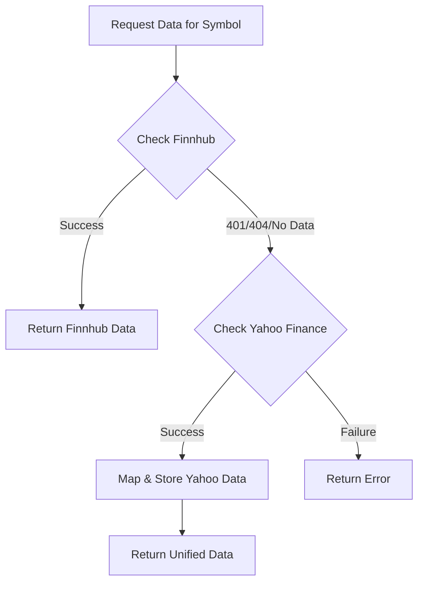

# Yahoo Finance Integration Documentation

This document outlines how `yahoo-finance2` can be integrated into the Neural-Ticker core as a fallback or complementary data source for Finnhub, especially for international markets.

## Available Endpoints & Real-World Data (SOI.PA Example)

### 1. `yahoo.quote(symbol)`
- **Purpose**: Real-time/delayed market price.
- **Example Data**:
```json
{
  "symbol": "SOI.PA",
  "regularMarketPrice": 23.3,
  "currency": "EUR",
  "fullExchangeName": "Paris",
  "marketCap": 831448064,
  "sharesOutstanding": 35684468
}
```

### 2. `yahoo.historical(symbol, options)`
- **Purpose**: Historical OHLCV data.
- **Example Data**:
```json
{
  "date": "2025-12-19T16:35:17.000Z",
  "open": 23.70,
  "high": 23.76,
  "low": 23.12,
  "close": 23.30,
  "volume": 265287
}
```

### 3. `yahoo.quoteSummary(symbol, options)`
- **Purpose**: Detailed fundamentals and company profile.
- **Example Data (Highlights)**:
```json
{
  "summaryProfile": {
    "sector": "Technology",
    "industry": "Semiconductor Equipment & Materials",
    "website": "https://www.soitec.com"
  },
  "financialData": {
    "recommendationKey": "hold",
    "targetMeanPrice": 32.41,
    "totalCash": 823729984,
    "totalDebt": 952681024
  },
  "defaultKeyStatistics": {
    "forwardPE": 28.46,
    "trailingEps": 0.29
  }
}
```

### 4. `yahoo.search(query)`
- **Purpose**: News and related metadata.
- **Example News Item**:
```json
{
  "title": "Truist Securities Adjusts Price Target on Regions Financial",
  "link": "https://finance.yahoo.com/news/...",
  "publisher": "Yahoo Finance"
}
```

---

## Unified DTO Mapping Strategy

| Project Entity | Project Field | Yahoo Field | Provider Module |
|----------------|---------------|-------------|-----------------|
| [TickerEntity](file:///c:/Users/brani/Documents/GitHub/neural-ticker-core/src/modules/tickers/entities/ticker.entity.ts#11-150) | `name` | `shortName` / `longName` | `quote` |
| [TickerEntity](file:///c:/Users/brani/Documents/GitHub/neural-ticker-core/src/modules/tickers/entities/ticker.entity.ts#11-150) | `description` | `longBusinessSummary` | `summaryProfile` |
| [PriceOhlcv](file:///c:/Users/brani/Documents/GitHub/neural-ticker-core/src/modules/market-data/entities/price-ohlcv.entity.ts#11-90) | `close` | `regularMarketPrice` | `quote` |
| [Fundamentals](file:///c:/Users/brani/Documents/GitHub/neural-ticker-core/src/modules/market-data/entities/fundamentals.entity.ts#5-287) | `market_cap` | `marketCap` | `quote` |
| [Fundamentals](file:///c:/Users/brani/Documents/GitHub/neural-ticker-core/src/modules/market-data/entities/fundamentals.entity.ts#5-287) | `pe_ttm` | `forwardPE` | `defaultKeyStatistics` |
| [CompanyNews](file:///c:/Users/brani/Documents/GitHub/neural-ticker-core/src/modules/market-data/entities/company-news.entity.ts#14-63) | `headline` | `title` | `search` |

---

## Proposed Integration Flow (Fallback Strategy)

To provide a seamless experience even when Finnhub lacks data (e.g., for European stocks), we can implement a **Provider Orchestrator** in our services.



### 1. Unified Interface
Create a `MarketDataProvider` interface that both [FinnhubService](file:///c:/Users/brani/Documents/GitHub/neural-ticker-core/src/modules/finnhub/finnhub.service.ts#7-108) and a future `YahooFinanceService` implement.

### 2. Multi-Provider Service
The `TickersService` or `MarketDataService` will try the primary provider (Finnhub) first. If it encounters a restriction or missing symbol, it falls back to the secondary provider (Yahoo).

### 3. Data Normalization
Each service will be responsible for mapping its provider-specific DTO into our internal entity shapes ([TickerEntity](file:///c:/Users/brani/Documents/GitHub/neural-ticker-core/src/modules/tickers/entities/ticker.entity.ts#11-150), [Fundamentals](file:///c:/Users/brani/Documents/GitHub/neural-ticker-core/src/modules/market-data/entities/fundamentals.entity.ts#5-287), etc.) before returning it to the core logic.
